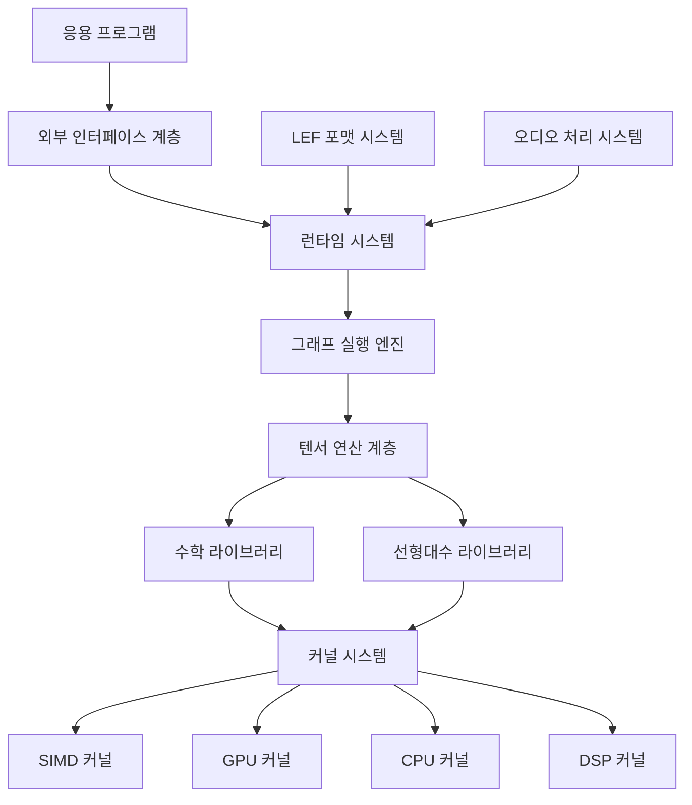

# LibEtude - Design Document

## Overview

LibEtude는 음성 합성에 특화된 AI 추론 엔진으로, 범용 AI 프레임워크가 아닌 음성 합성 도메인에 극도로 최적화된 시스템입니다. 본 설계 문서는 요구사항을 바탕으로 엔진의 아키텍처, 주요 컴포넌트, 데이터 흐름 및 최적화 전략을 상세히 기술합니다.

핵심 설계 원칙:
- **도메인 특화 최적화**: 음성 합성에 필요한 연산에 집중하여 불필요한 오버헤드 제거
- **계층적 모듈화**: 명확한 책임 분리와 확장성을 위한 계층적 컴포넌트 설계
- **하드웨어 최적화**: 다양한 하드웨어 환경에 맞춘 커널 시스템
- **메모리 효율성**: 제한된 리소스 환경에서도 효율적인 메모리 관리
- **실시간 성능**: 저지연 처리를 위한 스케줄링 및 최적화

## Architecture

LibEtude는 다음과 같은 계층적 아키텍처로 구성됩니다:



### 주요 계층 설명

1. **커널 시스템 (Kernels)**: 하드웨어별 최적화된 저수준 연산 구현
2. **수학/선형대수 라이브러리 (Math/LinearAlgebra)**: 고속 수학 함수 및 행렬 연산
3. **텐서 연산 계층 (Tensor)**: 다차원 데이터 처리 및 메모리 관리
4. **그래프 실행 엔진 (Graph)**: 딥러닝 모델의 계산 그래프 실행
5. **런타임 시스템 (Runtime)**: 작업 스케줄링, 메모리 할당, 프로파일링
6. **LEF 포맷 시스템 (LEF)**: 모델 직렬화, 압축, 로딩
7. **오디오 처리 시스템 (Audio)**: 음성 특화 DSP 처리
8. **외부 인터페이스 계층 (FFI)**: 다양한 언어 및 플랫폼 바인딩

## Components and Interfaces

### 1. 커널 시스템 (Kernels)

커널 시스템은 하드웨어별 최적화된 저수준 연산을 제공하는 핵심 컴포넌트입니다.

#### 1.1 커널 레지스트리

```c
// 커널 등록 및 선택 메커니즘
typedef struct {
    const char* name;
    void (*kernel_func)(void* params);
    uint32_t simd_support;  // NEON, SSE, AVX 플래그
    size_t optimal_size;    // 최적 데이터 크기
} SIMDKernel;

typedef struct {
    SIMDKernel* kernels[MAX_KERNELS];
    int (*selector)(uint32_t hw_caps);
    void* (*dispatcher)(const char* op_name);
} KernelRegistry;
```

#### 1.2 SIMD 커널 인터페이스

```c
// SIMD 커널 인터페이스
typedef enum {
    SIMD_NONE = 0,
    SIMD_SSE = 1 << 0,
    SIMD_SSE2 = 1 << 1,
    SIMD_SSE3 = 1 << 2,
    SIMD_SSSE3 = 1 << 3,
    SIMD_SSE4_1 = 1 << 4,
    SIMD_SSE4_2 = 1 << 5,
    SIMD_AVX = 1 << 6,
    SIMD_AVX2 = 1 << 7,
    SIMD_NEON = 1 << 8
} SIMDFeatures;

// 하드웨어 감지 및 커널 선택
uint32_t detect_simd_features();
void* select_optimal_kernel(const char* op_name, uint32_t simd_features, size_t data_size);
```

#### 1.3 GPU 커널 인터페이스

```c
// GPU 커널 추상화
typedef enum {
    GPU_NONE = 0,
    GPU_CUDA = 1,
    GPU_OPENCL = 2,
    GPU_METAL = 3
} GPUBackend;

typedef struct {
    GPUBackend backend;
    void* context;
    void* (*allocate)(size_t size);
    void (*free)(void* ptr);
    void (*sync)();
    void* (*load_kernel)(const char* name);
    void (*launch_kernel)(void* kernel, void** args, int grid_dim, int block_dim);
} GPUContext;

// GPU 컨텍스트 초기화
GPUContext* init_gpu_context(GPUBackend preferred_backend);
```

#### 1.4 DSP 커널 인터페이스

```c
// 음성 DSP 특화 커널
typedef struct {
    // STFT 설정
    int fft_size;
    int hop_size;
    int sample_rate;

    // Mel-scale 설정
    int n_mels;
    float mel_fmin, mel_fmax;

    // 최적화된 커널들
    void (*stft_kernel)(const float*, float*, float*);
    void (*mel_kernel)(const float*, float*);
    void (*istft_kernel)(const float*, const float*, float*);

    // 메모리 풀
    float* fft_buffer;
    float* mel_buffer;
    float* window;
} DSPPipeline;
```

### 2. 텐서 엔진 (Tensor)

텐서 엔진은 다차원 데이터 처리와 메모리 관리를 담당합니다.

#### 2.1 텐서 구조체

```c
typedef struct {
    void* data;           // 실제 데이터 포인터
    size_t* shape;        // 각 차원의 크기
    size_t* strides;      // 각 차원의 스트라이드
    size_t ndim;          // 차원 수
    size_t size;          // 총 요소 수
    ETDataType dtype;     // 데이터 타입 (float32, bf16, int8 등)
    ETMemoryType mem_type; // 메모리 타입 (CPU, GPU, 공유 등)
    ETMemoryPool* pool;   // 할당된 메모리 풀
} ETTensor;

// 데이터 타입 열거형
typedef enum {
    ET_FLOAT32 = 0,
    ET_FLOAT16 = 1,
    ET_BFLOAT16 = 2,
    ET_INT8 = 3,
    ET_INT4 = 4
} ETDataType;

// 메모리 타입 열거형
typedef enum {
    ET_MEM_CPU = 0,
    ET_MEM_GPU = 1,
    ET_MEM_SHARED = 2
} ETMemoryType;
```

#### 2.2 메모리 풀

```c
typedef struct {
    void* base;           // 기본 메모리 주소
    size_t size;          // 총 크기
    size_t used;          // 사용된 크기
    size_t alignment;     // 정렬 요구사항
    bool external;        // 외부 메모리 여부
    void* device_context; // GPU 컨텍스트 (필요시)
} ETMemoryPool;

// 메모리 풀 관리 함수
ETMemoryPool* et_create_memory_pool(size_t size, size_t alignment);
void* et_alloc_from_pool(ETMemoryPool* pool, size_t size);
void et_free_to_pool(ETMemoryPool* pool, void* ptr);
void et_reset_pool(ETMemoryPool* pool);
```

#### 2.3 텐서 연산

```c
// 기본 텐서 연산
ETTensor* et_create_tensor(ETMemoryPool* pool, ETDataType dtype, size_t ndim, size_t* shape);
void et_destroy_tensor(ETTensor* tensor);
ETTensor* et_reshape_tensor(ETTensor* tensor, size_t ndim, size_t* new_shape);
ETTensor* et_slice_tensor(ETTensor* tensor, size_t* start, size_t* end);

// 수학 연산
void et_add(ETTensor* a, ETTensor* b, ETTensor* out);
void et_mul(ETTensor* a, ETTensor* b, ETTensor* out);
void et_matmul(ETTensor* a, ETTensor* b, ETTensor* out);
void et_softmax(ETTensor* input, ETTensor* out, int axis);
```

### 3. 그래프 시스템 (Graph)

그래프 시스템은 딥러닝 모델의 계산 그래프를 표현하고 실행합니다.

#### 3.1 그래프 구조체

```c
typedef struct ETNode ETNode;
typedef struct ETGraph ETGraph;

struct ETNode {
    char* name;                // 노드 이름
    char* op_type;            // 연산자 타입
    ETTensor** inputs;        // 입력 텐서 배열
    size_t num_inputs;        // 입력 텐서 수
    ETTensor** outputs;       // 출력 텐서 배열
    size_t num_outputs;       // 출력 텐서 수
    void* attributes;         // 연산자 속성
    ETNode** input_nodes;     // 입력 노드 배열
    size_t num_input_nodes;   // 입력 노드 수
    ETNode** output_nodes;    // 출력 노드 배열
    size_t num_output_nodes;  // 출력 노드 수
    void (*forward)(ETNode*); // 순방향 함수
};

struct ETGraph {
    ETNode** nodes;           // 모든 노드 배열
    size_t num_nodes;         // 노드 수
    ETNode** input_nodes;     // 입력 노드 배열
    size_t num_input_nodes;   // 입력 노드 수
    ETNode** output_nodes;    // 출력 노드 배열
    size_t num_output_nodes;  // 출력 노드 수
    ETMemoryPool* mem_pool;   // 메모리 풀
};
```

#### 3.2 연산자 레지스트리

```c
typedef struct {
    char* name;                                // 연산자 이름
    void (*create)(ETNode*, void* attributes); // 생성 함수
    void (*forward)(ETNode*);                  // 순방향 함수
    void (*backward)(ETNode*);                 // 역방향 함수 (필요시)
    void (*destroy)(ETNode*);                  // 소멸 함수
} ETOperator;

// 연산자 레지스트리
typedef struct {
    ETOperator* operators;
    size_t num_operators;
    size_t capacity;
} ETOperatorRegistry;

// 연산자 등록 및 조회
void et_register_operator(ETOperatorRegistry* registry, ETOperator* op);
ETOperator* et_find_operator(ETOperatorRegistry* registry, const char* name);
```

#### 3.3 그래프 실행

```c
// 그래프 생성 및 실행
ETGraph* et_create_graph(size_t initial_nodes_capacity);
void et_add_node(ETGraph* graph, ETNode* node);
void et_connect_nodes(ETNode* src, ETNode* dst);
void et_execute_graph(ETGraph* graph, ETTensor** inputs, ETTensor** outputs);

// 그래프 최적화
void et_optimize_graph(ETGraph* graph, ETOptimizationFlags flags);
```

### 4. LEF 포맷 시스템 (LEF)

LEF 포맷 시스템은 모델 직렬화, 압축, 로딩을 담당합니다.

#### 4.1 LEF 파일 구조

```c
// LEF 파일 헤더
typedef struct {
    uint32_t magic;              // LEF_MAGIC ('LEED' in little-endian)
    uint16_t version_major;      // 주 버전
    uint16_t version_minor;      // 부 버전
    uint32_t flags;              // 압축, 양자화, 확장 플래그
    uint32_t file_size;          // 전체 파일 크기
    uint32_t model_hash;         // 모델 검증 해시 (CRC32)
    uint64_t timestamp;          // 생성 타임스탬프
    uint32_t compression_dict_offset;  // 압축 사전 오프셋
    uint32_t layer_index_offset;       // 레이어 인덱스 오프셋
    uint32_t layer_data_offset;        // 레이어 데이터 오프셋
    uint8_t  reserved[16];             // 향후 확장용
} __attribute__((packed)) LEFHeader;

// 모델 메타데이터
typedef struct {
    char model_name[64];         // 모델 이름
    char model_version[16];      // 모델 버전
    char author[32];             // 제작자
    char description[128];       // 설명

    // 모델 아키텍처 정보
    uint16_t input_dim;          // 입력 차원
    uint16_t output_dim;         // 출력 차원
    uint16_t hidden_dim;         // 은닉 차원
    uint16_t num_layers;         // 레이어 수
    uint16_t num_heads;          // 어텐션 헤드 수
    uint16_t vocab_size;         // 어휘 크기

    // 음성 특화 정보
    uint16_t sample_rate;        // 샘플링 레이트
    uint16_t mel_channels;       // Mel 채널 수
    uint16_t hop_length;         // Hop 길이
    uint16_t win_length;         // 윈도우 길이

    // 양자화 정보
    uint8_t default_quantization; // 기본 양자화 타입
    uint8_t mixed_precision;      // 혼합 정밀도 사용 여부
    uint16_t quantization_params_size; // 양자화 파라미터 크기

    uint8_t reserved[32];        // 향후 확장용
} __attribute__((packed)) LEFModelMeta;

// 레이어 헤더
typedef struct {
    uint16_t layer_id;           // 레이어 고유 ID
    uint8_t  layer_kind;         // 레이어 타입
    uint8_t  quantization_type;  // 양자화 타입
    uint32_t meta_size;          // 메타데이터 크기
    uint32_t data_size;          // 실제 데이터 크기
    uint32_t compressed_size;    // 압축된 크기
    uint32_t data_offset;        // 데이터 시작 오프셋
    uint32_t checksum;           // 데이터 체크섬
} __attribute__((packed)) LEFLayerHeader;
```

#### 4.2 확장 모델 포맷 (.lefx)

```c
// 확장 모델 헤더
typedef struct {
    uint32_t magic;                  // LEFX_MAGIC ('LEEX' in little-endian)
    uint16_t version_major;          // 확장 포맷 버전
    uint16_t version_minor;          // 확장 포맷 부 버전
    uint32_t extension_flags;        // 확장 타입 플래그
    uint32_t file_size;              // 확장 파일 크기

    // 기본 모델 참조 정보
    uint32_t base_model_hash;        // 기본 모델 해시 (호환성 검증)
    char base_model_version[16];     // 기본 모델 버전
    char base_model_name[32];        // 기본 모델 이름
    uint32_t required_base_size;     // 필요한 기본 모델 크기

    // 확장 메타데이터
    uint32_t extension_type;         // 확장 타입 (화자, 언어, 효과 등)
    uint16_t extension_id;           // 확장 ID (고유 식별자)
    char extension_name[32];         // 확장 이름
    char extension_author[32];       // 제작자
    char extension_version[16];      // 확장 버전

    // 확장 데이터 오프셋
    uint32_t meta_offset;            // 확장 메타데이터 오프셋
    uint32_t dependency_offset;      // 의존성 정보 오프셋
    uint32_t layer_index_offset;     // 확장 레이어 인덱스 오프셋
    uint32_t layer_data_offset;      // 확장 레이어 데이터 오프셋
    uint32_t plugin_data_offset;     // 플러그인 데이터 오프셋

    uint64_t timestamp;              // 생성 타임스탬프
    uint8_t reserved[24];            // 향후 확장용
} __attribute__((packed)) LEFXHeader;
```

#### 4.3 모델 로더 인터페이스

```c
// 모델 로더 인터페이스
typedef struct {
    LEFHeader header;
    LEFModelMeta meta;
    LEFLayerHeader* layer_headers;
    void** layer_data;
    size_t num_layers;
    ETMemoryPool* mem_pool;
    bool owns_memory;
} LEFModel;

// 모델 로딩 함수
LEFModel* lef_load_model(const char* path);
LEFModel* lef_load_model_from_memory(void* data, size_t size);
void lef_unload_model(LEFModel* model);

// 스트리밍 로더
typedef struct {
    FILE* file;
    LEFHeader header;
    LEFModelMeta meta;
    LEFLayerHeader* layer_index;

    // 스트리밍 상태
    int current_layer;
    bool* layers_loaded;
    uint8_t* layer_cache;
    size_t cache_size;

    // 비동기 로딩
    pthread_t loader_thread;
    bool async_loading;
} LEFStreamingLoader;

// 스트리밍 로딩 함수
LEFStreamingLoader* lef_create_streaming_loader(const char* path);
int lef_load_layer_on_demand(LEFStreamingLoader* loader, int layer_id);
```

### 5. 런타임 시스템 (Runtime)

런타임 시스템은 작업 스케줄링, 메모리 할당, 프로파일링을 담당합니다.

#### 5.1 작업 스케줄러

```c
// 작업 구조체
typedef struct {
    int priority;           // 작업 우선순위
    void (*task_func)(void*); // 작업 함수
    void* task_data;        // 작업 데이터
    uint64_t deadline;      // 데드라인 (실시간용)
} Task;

// 스케줄러 구조체
typedef struct {
    Task* task_queue;
    int queue_size;
    int head, tail;

    // 실시간 스케줄링
    bool realtime_mode;
    uint64_t audio_buffer_deadline;

    // 워커 스레드
    pthread_t* worker_threads;
    int num_workers;
} TaskScheduler;

// 스케줄러 함수
TaskScheduler* rt_create_scheduler(int queue_size, int num_workers);
int rt_enqueue_task(TaskScheduler* scheduler, Task* task);
void rt_set_realtime_mode(TaskScheduler* scheduler, bool enable);
void rt_destroy_scheduler(TaskScheduler* scheduler);
```

#### 5.2 메모리 할당자

```c
// 메모리 할당자 구조체
typedef struct {
    void* base_address;
    size_t total_size;
    size_t used_size;
    size_t peak_usage;

    // 메모리 블록 관리
    void* free_list;
    size_t block_alignment;

    // 통계
    size_t num_allocations;
    size_t num_frees;

    // 스레드 안전성
    pthread_mutex_t mutex;
} RTAllocator;

// 할당자 함수
RTAllocator* rt_create_allocator(size_t size, size_t alignment);
void* rt_alloc(RTAllocator* allocator, size_t size);
void rt_free(RTAllocator* allocator, void* ptr);
void rt_reset_allocator(RTAllocator* allocator);
void rt_destroy_allocator(RTAllocator* allocator);
```

#### 5.3 성능 프로파일러

```c
// 프로파일 항목
typedef struct {
    const char* op_name;
    uint64_t start_time;
    uint64_t end_time;
    uint64_t cpu_cycles;
    size_t memory_used;
} ProfileEntry;

// 프로파일러 구조체
typedef struct {
    ProfileEntry* entries;
    int entry_count;
    int capacity;

    // 통계
    uint64_t total_inference_time;
    uint64_t total_memory_peak;
    float avg_cpu_usage;
} Profiler;

// 프로파일링 함수
Profiler* rt_create_profiler(int capacity);
void rt_start_profile(Profiler* profiler, const char* name);
void rt_end_profile(Profiler* profiler, const char* name);
void rt_generate_report(Profiler* profiler, const char* output_path);
void rt_destroy_profiler(Profiler* profiler);
```

### 6. 오디오 처리 시스템 (Audio)

오디오 처리 시스템은 음성 특화 DSP 처리를 담당합니다.

#### 6.1 오디오 I/O

```c
// 오디오 포맷
typedef struct {
    uint32_t sample_rate;
    uint16_t bit_depth;
    uint16_t num_channels;
    uint32_t frame_size;
    uint32_t buffer_size;
} AudioFormat;

// 오디오 디바이스
typedef struct {
    const char* device_name;
    AudioFormat format;
    void* device_handle;
    bool is_input;

    // 콜백
    void (*audio_callback)(float* buffer, int num_frames, void* user_data);
    void* user_data;
} AudioDevice;

// 오디오 I/O 함수
AudioDevice* audio_open_output_device(const char* device_name, AudioFormat* format);
AudioDevice* audio_open_input_device(const char* device_name, AudioFormat* format);
void audio_close_device(AudioDevice* device);
void audio_set_callback(AudioDevice* device, void (*callback)(float*, int, void*), void* user_data);
void audio_start(AudioDevice* device);
void audio_stop(AudioDevice* device);
```

#### 6.2 STFT/ISTFT 처리

```c
// STFT 컨텍스트
typedef struct {
    int fft_size;
    int hop_size;
    int win_length;
    float* window;
    void* fft_context;
    float* buffer;
    float* output_real;
    float* output_imag;
} STFTContext;

// STFT 함수
STFTContext* audio_create_stft_context(int fft_size, int hop_size, int win_length);
void audio_stft(STFTContext* ctx, const float* audio, int audio_len, float* magnitude, float* phase);
void audio_istft(STFTContext* ctx, const float* magnitude, const float* phase, float* audio, int* audio_len);
void audio_destroy_stft_context(STFTContext* ctx);
```

#### 6.3 Mel 스케일 변환

```c
// Mel 필터뱅크
typedef struct {
    int n_fft;
    int n_mels;
    float fmin;
    float fmax;
    int sample_rate;
    float* mel_filters;
} MelFilterbank;

// Mel 변환 함수
MelFilterbank* audio_create_mel_filterbank(int n_fft, int n_mels, float fmin, float fmax, int sample_rate);
void audio_spectrogram_to_mel(MelFilterbank* mel_fb, const float* spectrogram, int time_frames, float* mel_spec);
void audio_mel_to_spectrogram(MelFilterbank* mel_fb, const float* mel_spec, int time_frames, float* spectrogram);
void audio_destroy_mel_filterbank(MelFilterbank* mel_fb);
```

#### 6.4 보코더 인터페이스

```c
// 보코더 컨텍스트
typedef struct {
    int mel_channels;
    int sample_rate;
    void* vocoder_model;
    ETGraph* vocoder_graph;
    ETMemoryPool* mem_pool;
} VocoderContext;

// 보코더 함수
VocoderContext* audio_create_vocoder(const char* model_path, int mel_channels, int sample_rate);
void audio_mel_to_audio(VocoderContext* ctx, const float* mel_spec, int time_frames, float* audio, int* audio_len);
void audio_destroy_vocoder(VocoderContext* ctx);
```

### 7. 외부 인터페이스 (FFI)

외부 인터페이스는 다양한 언어 및 플랫폼 바인딩을 제공합니다.

#### 7.1 C API

```c
// 엔진 생성/해제
typedef struct LibEtudeEngine LibEtudeEngine;

LibEtudeEngine* libetude_create_engine(const char* model_path);
void libetude_destroy_engine(LibEtudeEngine* engine);

// 음성 합성 (동기)
int libetude_synthesize_text(LibEtudeEngine* engine,
                            const char* text,
                            float* output_audio,
                            int* output_length);

// 노래 합성 (동기)
int libetude_synthesize_singing(LibEtudeEngine* engine,
                                const char* lyrics,
                                const float* notes,
                                int note_count,
                                float* output_audio,
                                int* output_length);

// 실시간 스트리밍 (비동기)
typedef void (*AudioStreamCallback)(const float* audio, int length, void* user_data);

int libetude_start_streaming(LibEtudeEngine* engine,
                            AudioStreamCallback callback,
                            void* user_data);

int libetude_stream_text(LibEtudeEngine* engine, const char* text);
int libetude_stop_streaming(LibEtudeEngine* engine);

// 성능 제어
int libetude_set_quality_mode(LibEtudeEngine* engine, int quality_mode);
int libetude_enable_gpu_acceleration(LibEtudeEngine* engine);
int libetude_get_performance_stats(LibEtudeEngine* engine, PerformanceStats* stats);
```

#### 7.2 C++ 바인딩

```cpp
// C++ 래퍼 클래스
namespace libetude {

class Engine {
public:
    Engine(const std::string& model_path);
    ~Engine();

    // 음성 합성
    std::vector<float> synthesizeText(const std::string& text);
    std::vector<float> synthesizeSinging(const std::string& lyrics, const std::vector<float>& notes);

    // 스트리밍
    void startStreaming(std::function<void(const float*, int)> callback);
    void streamText(const std::string& text);
    void stopStreaming();

    // 설정
    void setQualityMode(QualityMode mode);
    void enableGPUAcceleration(bool enable = true);
    PerformanceStats getPerformanceStats();

private:
    LibEtudeEngine* engine_;
    bool streaming_active_;
    static void streamCallbackWrapper(const float* audio, int length, void* user_data);
};

} // namespace libetude
```

#### 7.3 모바일 바인딩

```c
// Android JNI 인터페이스
JNIEXPORT jlong JNICALL
Java_com_libetude_Engine_createEngine(JNIEnv* env, jobject thiz, jstring model_path);

JNIEXPORT void JNICALL
Java_com_libetude_Engine_destroyEngine(JNIEnv* env, jobject thiz, jlong engine_ptr);

JNIEXPORT jfloatArray JNICALL
Java_com_libetude_Engine_synthesizeText(JNIEnv* env, jobject thiz, jlong engine_ptr, jstring text);

// iOS Objective-C 인터페이스
@interface LibEtudeEngine : NSObject

- (instancetype)initWithModelPath:(NSString *)modelPath;
- (NSData *)synthesizeText:(NSString *)text;
- (void)startStreamingWithCallback:(void (^)(NSData *audioData))callback;
- (void)streamText:(NSString *)text;
- (void)stopStreaming;

@end
```

## Data Models

### 1. 텐서 데이터 모델

텐서는 다차원 데이터를 표현하는 기본 단위입니다.

```c
// 텐서 데이터 모델
typedef struct {
    void* data;           // 실제 데이터 포인터
    size_t* shape;        // 각 차원의 크기
    size_t* strides;      // 각 차원의 스트라이드
    size_t ndim;          // 차원 수
    size_t size;          // 총 요소 수
    ETDataType dtype;     // 데이터 타입 (float32, bf16, int8 등)
    ETMemoryType mem_type; // 메모리 타입 (CPU, GPU, 공유 등)
    ETMemoryPool* pool;   // 할당된 메모리 풀
} ETTensor;
```

### 2. 음성 합성 모델

음성 합성 모델은 텍스트를 오디오로 변환하는 과정을 표현합니다.

```c
// 음성 합성 모델
typedef struct {
    // 텍스트 처리
    ETGraph* text_encoder;

    // 음성 생성
    ETGraph* duration_predictor;
    ETGraph* pitch_predictor;
    ETGraph* mel_decoder;

    // 보코더
    ETGraph* vocoder;

    // 설정
    int sample_rate;
    int mel_channels;
    int hop_length;
} TTSModel;
```

### 3. 음성 특성 모델

음성 특성 모델은 화자의 특성을 표현합니다.

```c
// 화자 특성 모델
typedef struct {
    // 화자 정보
    uint8_t gender;              // 성별 (0=남성, 1=여성, 2=중성)
    uint8_t age_range;           // 연령대 (0=어린이, 1=청년, 2=중년, 3=노년)
    uint8_t voice_tone;          // 음색 (0=낮음, 1=보통, 2=높음)
    uint8_t speaking_speed;      // 말하기 속도 기본값

    // 음성 특성
    float pitch_range[2];        // 피치 범위 [min, max] (Hz)
    float formant_shift;         // 포만트 이동 계수
    uint8_t accent_strength;     // 억양 강도 (0-100)

    // 확장 레이어
    LEFXLayerEntry* layers;      // 확장 레이어 배열
    int layer_count;             // 레이어 수
} SpeakerModel;
```

### 4. 오디오 데이터 모델

오디오 데이터는 파형과 스펙트럼 표현을 포함합니다.

```c
// 오디오 파형 데이터
typedef struct {
    float* samples;
    int num_samples;
    int sample_rate;
    int num_channels;
} AudioWaveform;

// 스펙트로그램 데이터
typedef struct {
    float* magnitude;
    float* phase;
    int time_frames;
    int freq_bins;
    int hop_length;
    int fft_size;
} Spectrogram;

// Mel 스펙트로그램 데이터
typedef struct {
    float* mel_spec;
    int time_frames;
    int mel_bins;
    int hop_length;
} MelSpectrogram;
```

## Error Handling

### 1. 오류 코드 시스템

```c
// 오류 코드 열거형
typedef enum {
    ET_SUCCESS = 0,
    ET_ERROR_INVALID_ARGUMENT = -1,
    ET_ERROR_OUT_OF_MEMORY = -2,
    ET_ERROR_IO = -3,
    ET_ERROR_NOT_IMPLEMENTED = -4,
    ET_ERROR_RUNTIME = -5,
    ET_ERROR_HARDWARE = -6,
    ET_ERROR_MODEL = -7,
    ET_ERROR_TIMEOUT = -8
} ETErrorCode;

// 오류 정보 구조체
typedef struct {
    ETErrorCode code;
    char message[256];
    const char* file;
    int line;
    const char* function;
} ETError;

// 오류 처리 함수
ETError* et_get_last_error();
const char* et_error_string(ETErrorCode code);
void et_clear_error();
```

### 2. 오류 콜백 시스템

```c
// 오류 콜백 타입
typedef void (*ETErrorCallback)(ETError* error, void* user_data);

// 오류 콜백 설정
void et_set_error_callback(ETErrorCallback callback, void* user_data);
```

### 3. 오류 로깅 시스템

```c
// 로그 레벨
typedef enum {
    ET_LOG_DEBUG = 0,
    ET_LOG_INFO = 1,
    ET_LOG_WARNING = 2,
    ET_LOG_ERROR = 3,
    ET_LOG_FATAL = 4
} ETLogLevel;

// 로그 콜백
typedef void (*ETLogCallback)(ETLogLevel level, const char* message, void* user_data);

// 로그 함수
void et_log(ETLogLevel level, const char* format, ...);
void et_set_log_level(ETLogLevel level);
void et_set_log_callback(ETLogCallback callback, void* user_data);
```

## Testing Strategy

### 1. 단위 테스트

각 컴포넌트의 기능을 독립적으로 검증하는 단위 테스트를 구현합니다.

- **커널 테스트**: 각 SIMD/GPU 커널의 정확성 및 성능 테스트
- **텐서 연산 테스트**: 기본 텐서 연산의 정확성 테스트
- **그래프 실행 테스트**: 간단한 그래프의 실행 정확성 테스트
- **LEF 포맷 테스트**: 모델 저장 및 로딩 테스트
- **메모리 관리 테스트**: 메모리 풀 및 할당자 테스트

### 2. 통합 테스트

여러 컴포넌트를 함께 테스트하여 상호작용을 검증합니다.

- **엔드투엔드 파이프라인 테스트**: 텍스트 입력부터 오디오 출력까지 전체 파이프라인 테스트
- **성능 테스트**: 다양한 하드웨어 환경에서의 성능 측정
- **메모리 누수 테스트**: 장시간 실행 시 메모리 누수 검사
- **스트레스 테스트**: 높은 부하 상황에서의 안정성 테스트

### 3. 플랫폼별 테스트

다양한 플랫폼에서의 호환성을 검증합니다.

- **데스크톱 테스트**: Windows, macOS, Linux에서의 테스트
- **모바일 테스트**: Android, iOS에서의 테스트
- **임베디드 테스트**: 저사양 임베디드 환경에서의 테스트

### 4. 자동화 테스트 프레임워크

테스트 자동화를 위한 프레임워크를 구현합니다.

```c
// 테스트 케이스 구조체
typedef struct {
    const char* name;
    void (*setup)();
    void (*teardown)();
    void (*test_func)();
    bool passed;
    char error_message[256];
} ETTestCase;

// 테스트 스위트 구조체
typedef struct {
    const char* name;
    ETTestCase* test_cases;
    int num_test_cases;
    int passed_count;
    int failed_count;
} ETTestSuite;

// 테스트 실행 함수
void et_run_test_suite(ETTestSuite* suite);
void et_run_all_tests();
```

### 5. 벤치마크 프레임워크

성능 측정을 위한 벤치마크 프레임워크를 구현합니다.

```c
// 벤치마크 결과 구조체
typedef struct {
    const char* name;
    double execution_time_ms;
    double memory_usage_mb;
    double cpu_usage_percent;
    double gpu_usage_percent;
} ETBenchmarkResult;

// 벤치마크 함수
void et_run_benchmark(const char* name, void (*benchmark_func)(), ETBenchmarkResult* result);
void et_print_benchmark_results(ETBenchmarkResult* results, int num_results);
```

## 구현 계획 및 최적화 전략

### 1. 하드웨어 최적화 전략

- **SIMD 최적화**: x86 (SSE, AVX) 및 ARM (NEON) 아키텍처에 대한 벡터화 구현
- **GPU 가속**: CUDA, OpenCL, Metal을 통한 병렬 처리
- **캐시 최적화**: 메모리 접근 패턴 최적화 및 캐시 친화적 데이터 구조
- **메모리 정렬**: 하드웨어 특성에 맞는 메모리 정렬 및 패딩

### 2. 메모리 최적화 전략

- **메모리 풀링**: 동적 할당 최소화를 위한 메모리 풀 사용
- **인플레이스 연산**: 중간 결과 저장을 위한 추가 메모리 할당 최소화
- **메모리 재사용**: 불필요한 복사 연산 제거 및 버퍼 재사용
- **양자화**: BF16, INT8, INT4 등 저정밀도 표현을 통한 메모리 절약

### 3. 실시간 처리 전략

- **스트리밍 처리**: 청크 단위 처리를 통한 지연 시간 최소화
- **우선순위 스케줄링**: 실시간 작업에 높은 우선순위 부여
- **데드라인 기반 스케줄링**: 오디오 버퍼 언더런 방지를 위한 데드라인 관리
- **병렬 처리**: 파이프라인 병렬화를 통한 처리량 증가

### 4. 크로스 플랫폼 전략

- **플랫폼 추상화 계층**: 플랫폼별 구현을 캡슐화하는 추상화 계층 제공
- **조건부 컴파일**: 플랫폼별 최적화를 위한 조건부 컴파일 사용
- **동적 감지 및 적응**: 런타임에 하드웨어 기능 감지 및 최적 구현 선택
- **플랫폼별 빌드 시스템**: 각 플랫폼에 최적화된 빌드 설정 제공

### 5. 모델 최적화 전략

- **그래프 최적화**: 연산자 융합, 불필요한 연산 제거 등을 통한 그래프 최적화
- **양자화 최적화**: 레이어별 최적 양자화 전략 적용
- **스파스 연산**: 희소 행렬 최적화를 통한 연산 가속
- **모델 프루닝**: 중요도가 낮은 가중치 제거를 통한 모델 경량화

## 결론

LibEtude은 음성 합성에 특화된 고성능 AI 추론 엔진으로, 모듈식 아키텍처와 하드웨어 최적화를 통해 다양한 플랫폼에서 실시간 처리를 가능하게 합니다. LEF 포맷 시스템을 통해 효율적인 모델 배포와 확장을 지원하며, 고속 수학 함수와 메모리 최적화를 통해 제한된 리소스 환경에서도 우수한 성능을 제공합니다.

이 설계 문서는 요구사항을 바탕으로 엔진의 주요 컴포넌트와 인터페이스를 정의하고, 데이터 모델, 오류 처리, 테스트 전략 및 최적화 방안을 제시합니다. 이를 통해 음성 합성 애플리케이션 개발자들에게 강력하고 유연한 기반을 제공할 것입니다.