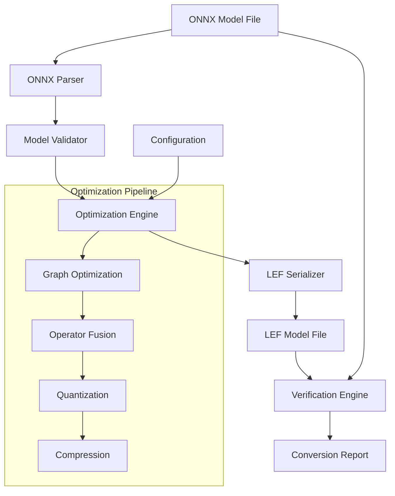

# Design Document

## Overview

ONNX to LEF 변환기는 표준 ONNX 모델을 LibEtude의 최적화된 LEF 형식으로 변환하는 핵심 컴포넌트입니다. 이 변환기는 음성 합성에 특화된 최적화를 적용하여 모델 크기를 줄이고 추론 성능을 향상시킵니다.

변환 과정은 다음과 같은 단계로 구성됩니다:
1. ONNX 모델 파싱 및 검증
2. 음성 합성 특화 최적화 적용
3. LEF 형식으로 직렬화
4. 변환 결과 검증

## Architecture

### 시스템 아키텍처



### 컴포넌트 계층 구조

```
onnx_to_lef_converter/
├── core/
│   ├── converter.h/.c          # 메인 변환기 인터페이스
│   ├── onnx_parser.h/.c        # ONNX 모델 파싱
│   ├── lef_serializer.h/.c     # LEF 형식 직렬화
│   └── verification.h/.c       # 변환 결과 검증
├── optimization/
│   ├── graph_optimizer.h/.c    # 그래프 최적화
│   ├── operator_fusion.h/.c    # 연산자 융합
│   ├── quantization.h/.c       # 양자화 최적화
│   └── compression.h/.c        # 압축 최적화
├── operators/
│   ├── operator_registry.h/.c  # 연산자 레지스트리
│   ├── conv_ops.h/.c          # 컨볼루션 연산자
│   ├── linear_ops.h/.c        # 선형 연산자
│   ├── activation_ops.h/.c    # 활성화 함수
│   └── attention_ops.h/.c     # 어텐션 연산자
├── utils/
│   ├── memory_manager.h/.c    # 메모리 관리
│   ├── error_handling.h/.c    # 에러 처리
│   └── logging.h/.c           # 로깅 시스템
├── bindings/
│   ├── python/
│   │   ├── onnx_to_lef_module.c    # 파이썬 C 확장 모듈
│   │   ├── python_api.h/.c         # 파이썬 API 래퍼
│   │   ├── numpy_utils.h/.c        # NumPy 호환성 유틸리티
│   │   └── exception_handling.h/.c # 파이썬 예외 처리
│   └── python_package/
│       ├── setup.py                # 패키지 설치 스크립트
│       ├── pyproject.toml          # 현대적 패키지 설정
│       ├── libetude_converter/     # 파이썬 패키지
│       │   ├── __init__.py
│       │   ├── converter.py        # 메인 파이썬 API
│       │   ├── config.py           # 설정 클래스
│       │   ├── utils.py            # 유틸리티 함수
│       │   └── visualization.py    # 시각화 도구
│       └── tests/                  # 파이썬 테스트
└── tools/
    └── onnx_to_lef_tool.c     # 명령줄 도구
```

## Components and Interfaces

### 1. Core Converter Interface

```c
/**
 * ONNX to LEF 변환기 메인 인터페이스
 */
typedef struct {
    char* input_path;                    // 입력 ONNX 파일 경로
    char* output_path;                   // 출력 LEF 파일 경로
    ONNXToLEFConfig* config;            // 변환 설정
    ONNXModel* onnx_model;              // 파싱된 ONNX 모델
    LEFModel* lef_model;                // 변환된 LEF 모델
    ConversionStats* stats;             // 변환 통계
    ErrorContext* error_ctx;            // 에러 컨텍스트
} ONNXToLEFConverter;

/**
 * 변환 설정 구조체
 */
typedef struct {
    // 최적화 설정
    bool enable_graph_optimization;      // 그래프 최적화 활성화
    bool enable_operator_fusion;        // 연산자 융합 활성화
    bool enable_quantization;           // 양자화 활성화
    bool enable_compression;            // 압축 활성화

    // 양자화 설정
    LEFQuantizationType quantization_type; // 양자화 타입
    float quantization_threshold;        // 양자화 임계값
    bool mixed_precision;               // 혼합 정밀도 사용

    // 압축 설정
    uint8_t compression_level;          // 압축 레벨 (1-9)
    bool enable_differential_compression; // 차분 압축 활성화

    // 검증 설정
    bool enable_verification;           // 변환 결과 검증 활성화
    float verification_tolerance;       // 검증 허용 오차

    // 출력 설정
    bool verbose_output;                // 상세 출력 활성화
    char* log_file_path;               // 로그 파일 경로
} ONNXToLEFConfig;

// 메인 변환 함수들
ONNXToLEFConverter* onnx_to_lef_create_converter(const char* input_path, const char* output_path);
void onnx_to_lef_destroy_converter(ONNXToLEFConverter* converter);
int onnx_to_lef_convert(ONNXToLEFConverter* converter, const ONNXToLEFConfig* config);
```

### 2. ONNX Parser

```c
/**
 * ONNX 모델 구조체
 */
typedef struct {
    // 모델 메타데이터
    char* model_name;
    char* model_version;
    char* producer_name;
    int64_t model_version_number;

    // 그래프 정보
    ONNXGraph* graph;
    ONNXValueInfo* inputs;
    ONNXValueInfo* outputs;
    size_t num_inputs;
    size_t num_outputs;

    // 연산자 정보
    ONNXNode* nodes;
    size_t num_nodes;

    // 초기화 데이터
    ONNXTensor* initializers;
    size_t num_initializers;

    // 메타데이터
    ONNXMetadata* metadata;
} ONNXModel;

/**
 * ONNX 그래프 구조체
 */
typedef struct {
    char* name;
    ONNXNode* nodes;
    size_t num_nodes;
    ONNXValueInfo* inputs;
    ONNXValueInfo* outputs;
    ONNXValueInfo* value_infos;
    size_t num_inputs;
    size_t num_outputs;
    size_t num_value_infos;
} ONNXGraph;

/**
 * ONNX 노드 구조체
 */
typedef struct {
    char* name;
    char* op_type;
    char* domain;
    ONNXAttribute* attributes;
    size_t num_attributes;
    char** inputs;
    char** outputs;
    size_t num_inputs;
    size_t num_outputs;
} ONNXNode;

// ONNX 파싱 함수들
ONNXModel* onnx_parse_model(const char* file_path);
void onnx_free_model(ONNXModel* model);
bool onnx_validate_model(const ONNXModel* model);
```

### 3. Optimization Engine

```c
/**
 * 그래프 최적화 컨텍스트
 */
typedef struct {
    ONNXGraph* graph;
    OptimizationStats* stats;
    bool* node_removed;                 // 제거된 노드 마킹
    bool* node_fused;                   // 융합된 노드 마킹
} GraphOptimizationContext;

/**
 * 최적화 통계
 */
typedef struct {
    int nodes_removed;                  // 제거된 노드 수
    int nodes_fused;                    // 융합된 노드 수
    int constants_folded;               // 상수 폴딩된 노드 수
    size_t memory_saved;                // 절약된 메모리 (바이트)
    float optimization_time;            // 최적화 소요 시간 (초)
} OptimizationStats;

// 최적화 함수들
int optimize_graph(GraphOptimizationContext* ctx);
int fuse_operators(GraphOptimizationContext* ctx);
int fold_constants(GraphOptimizationContext* ctx);
int eliminate_dead_nodes(GraphOptimizationContext* ctx);
```

### 4. LEF Serializer

```c
/**
 * LEF 직렬화 컨텍스트
 */
typedef struct {
    LEFSerializationContext* lef_ctx;   // LEF 직렬화 컨텍스트
    ONNXModel* onnx_model;              // 소스 ONNX 모델
    LayerMapping* layer_mappings;       // 레이어 매핑 정보
    size_t num_mappings;                // 매핑 수
    CompressionContext* compression_ctx; // 압축 컨텍스트
} LEFSerializationState;

/**
 * 레이어 매핑 정보
 */
typedef struct {
    char* onnx_node_name;               // ONNX 노드 이름
    uint16_t lef_layer_id;              // LEF 레이어 ID
    LEFLayerKind layer_kind;            // LEF 레이어 타입
    void* converted_data;               // 변환된 데이터
    size_t data_size;                   // 데이터 크기
    LEFQuantizationParams* quant_params; // 양자화 파라미터
} LayerMapping;

// LEF 직렬화 함수들
LEFSerializationState* create_lef_serialization_state(ONNXModel* onnx_model, const char* output_path);
void destroy_lef_serialization_state(LEFSerializationState* state);
int serialize_onnx_to_lef(LEFSerializationState* state, const ONNXToLEFConfig* config);
int convert_onnx_node_to_lef_layer(const ONNXNode* node, LayerMapping* mapping);
```

### 5. Operator Registry

```c
/**
 * 연산자 변환 함수 타입
 */
typedef int (*OperatorConverter)(const ONNXNode* onnx_node, LEFLayerData* lef_layer);

/**
 * 연산자 레지스트리 엔트리
 */
typedef struct {
    char* onnx_op_type;                 // ONNX 연산자 타입
    LEFLayerKind lef_layer_kind;        // 대응하는 LEF 레이어 타입
    OperatorConverter converter;        // 변환 함수
    bool is_supported;                  // 지원 여부
    char* description;                  // 설명
} OperatorRegistryEntry;

// 연산자 레지스트리 함수들
void init_operator_registry();
void cleanup_operator_registry();
OperatorRegistryEntry* find_operator_converter(const char* onnx_op_type);
int register_operator_converter(const char* onnx_op_type, LEFLayerKind lef_kind, OperatorConverter converter);
bool is_operator_supported(const char* onnx_op_type);
```

## Data Models

### 1. ONNX 데이터 모델

```c
/**
 * ONNX 텐서 구조체
 */
typedef struct {
    char* name;
    ONNXDataType data_type;
    int64_t* dims;
    size_t num_dims;
    void* raw_data;
    size_t data_size;
} ONNXTensor;

/**
 * ONNX 데이터 타입
 */
typedef enum {
    ONNX_DATA_TYPE_FLOAT = 1,
    ONNX_DATA_TYPE_UINT8 = 2,
    ONNX_DATA_TYPE_INT8 = 3,
    ONNX_DATA_TYPE_UINT16 = 4,
    ONNX_DATA_TYPE_INT16 = 5,
    ONNX_DATA_TYPE_INT32 = 6,
    ONNX_DATA_TYPE_INT64 = 7,
    ONNX_DATA_TYPE_STRING = 8,
    ONNX_DATA_TYPE_BOOL = 9,
    ONNX_DATA_TYPE_FLOAT16 = 10,
    ONNX_DATA_TYPE_DOUBLE = 11,
    ONNX_DATA_TYPE_UINT32 = 12,
    ONNX_DATA_TYPE_UINT64 = 13,
    ONNX_DATA_TYPE_COMPLEX64 = 14,
    ONNX_DATA_TYPE_COMPLEX128 = 15,
    ONNX_DATA_TYPE_BFLOAT16 = 16
} ONNXDataType;

/**
 * ONNX 속성 구조체
 */
typedef struct {
    char* name;
    ONNXAttributeType type;
    union {
        float f;
        int64_t i;
        char* s;
        ONNXTensor* t;
        ONNXGraph* g;
        float* floats;
        int64_t* ints;
        char** strings;
    } value;
    size_t value_count;
} ONNXAttribute;
```

### 2. 변환 통계 모델

```c
/**
 * 변환 통계 구조체
 */
typedef struct {
    // 입력 모델 정보
    size_t input_file_size;             // 입력 파일 크기
    size_t input_num_nodes;             // 입력 노드 수
    size_t input_num_parameters;        // 입력 파라미터 수

    // 출력 모델 정보
    size_t output_file_size;            // 출력 파일 크기
    size_t output_num_layers;           // 출력 레이어 수
    size_t output_num_parameters;       // 출력 파라미터 수

    // 최적화 결과
    float compression_ratio;            // 압축 비율
    int nodes_optimized;                // 최적화된 노드 수
    int operators_fused;                // 융합된 연산자 수

    // 성능 정보
    float conversion_time;              // 변환 소요 시간
    float verification_time;            // 검증 소요 시간
    size_t peak_memory_usage;           // 최대 메모리 사용량

    // 검증 결과
    bool verification_passed;           // 검증 통과 여부
    float max_error;                    // 최대 오차
    float avg_error;                    // 평균 오차
} ConversionStats;
```

## Error Handling

### 에러 코드 정의

```c
typedef enum {
    ONNX_TO_LEF_SUCCESS = 0,
    ONNX_TO_LEF_ERROR_INVALID_INPUT = -1,
    ONNX_TO_LEF_ERROR_FILE_NOT_FOUND = -2,
    ONNX_TO_LEF_ERROR_INVALID_ONNX_FORMAT = -3,
    ONNX_TO_LEF_ERROR_UNSUPPORTED_OPERATOR = -4,
    ONNX_TO_LEF_ERROR_MEMORY_ALLOCATION = -5,
    ONNX_TO_LEF_ERROR_SERIALIZATION_FAILED = -6,
    ONNX_TO_LEF_ERROR_VERIFICATION_FAILED = -7,
    ONNX_TO_LEF_ERROR_OPTIMIZATION_FAILED = -8,
    ONNX_TO_LEF_ERROR_COMPRESSION_FAILED = -9,
    ONNX_TO_LEF_ERROR_IO_ERROR = -10
} ONNXToLEFErrorCode;

/**
 * 에러 컨텍스트 구조체
 */
typedef struct {
    ONNXToLEFErrorCode error_code;      // 에러 코드
    char* error_message;                // 에러 메시지
    char* error_location;               // 에러 발생 위치
    void* error_data;                   // 추가 에러 데이터
    struct ErrorContext* next;          // 에러 체인
} ErrorContext;

// 에러 처리 함수들
ErrorContext* create_error_context(ONNXToLEFErrorCode code, const char* message, const char* location);
void destroy_error_context(ErrorContext* ctx);
void add_error_to_context(ErrorContext* ctx, ONNXToLEFErrorCode code, const char* message, const char* location);
const char* get_error_string(ONNXToLEFErrorCode code);
void print_error_context(const ErrorContext* ctx);
```

## Testing Strategy

### 1. 단위 테스트

```c
// 테스트 케이스 구조체
typedef struct {
    char* test_name;
    char* input_onnx_path;
    char* expected_output_path;
    ONNXToLEFConfig* config;
    bool should_succeed;
    ONNXToLEFErrorCode expected_error;
} TestCase;

// 단위 테스트 함수들
void test_onnx_parser();
void test_operator_conversion();
void test_graph_optimization();
void test_lef_serialization();
void test_verification_engine();
void test_error_handling();
```

### 2. 통합 테스트

```c
// 통합 테스트 시나리오
typedef struct {
    char* scenario_name;
    char* input_model_path;
    ONNXToLEFConfig* config;
    float expected_compression_ratio;
    float max_allowed_error;
    bool should_pass_verification;
} IntegrationTestScenario;

// 통합 테스트 함수들
void test_end_to_end_conversion();
void test_batch_conversion();
void test_large_model_conversion();
void test_quantization_accuracy();
void test_compression_efficiency();
```

### 3. 성능 테스트

```c
// 성능 벤치마크 구조체
typedef struct {
    char* model_name;
    size_t model_size;
    float conversion_time_limit;        // 변환 시간 제한 (초)
    size_t memory_limit;                // 메모리 사용량 제한 (바이트)
    float min_compression_ratio;        // 최소 압축 비율
} PerformanceBenchmark;

// 성능 테스트 함수들
void benchmark_conversion_speed();
void benchmark_memory_usage();
void benchmark_compression_ratio();
void benchmark_verification_accuracy();
```

### 4. 호환성 테스트

```c
// 호환성 테스트 매트릭스
typedef struct {
    char* onnx_version;
    char* opset_version;
    char** supported_operators;
    size_t num_operators;
    bool is_supported;
} CompatibilityMatrix;

// 호환성 테스트 함수들
void test_onnx_version_compatibility();
void test_opset_compatibility();
void test_operator_support();
void test_platform_compatibility();
```

## Implementation Notes

### 1. 메모리 관리 전략

- **스트리밍 처리**: 대용량 모델을 위한 청크 단위 처리
- **메모리 풀**: 빈번한 할당/해제를 위한 메모리 풀 사용
- **참조 카운팅**: 공유 데이터의 안전한 관리

### 2. 최적화 전략

- **그래프 최적화**: 불필요한 노드 제거, 상수 폴딩
- **연산자 융합**: 연속된 연산자들의 융합으로 성능 향상
- **양자화**: 음성 합성에 적합한 양자화 기법 적용
- **압축**: 차분 압축 및 허프만 코딩 활용

### 3. 확장성 고려사항

- **플러그인 아키텍처**: 새로운 연산자 지원을 위한 플러그인 시스템
- **설정 기반 최적화**: 사용자 정의 최적화 파이프라인
- **다중 백엔드 지원**: 다양한 하드웨어 백엔드 지원

### 4. 보안 고려사항

- **입력 검증**: 악의적인 ONNX 파일에 대한 보호
- **메모리 보안**: 버퍼 오버플로우 방지
- **파일 시스템 보안**: 안전한 파일 입출력

## Python Bindings Architecture

### 1. 파이썬 C 확장 모듈

```c
/**
 * 파이썬 변환기 객체 구조체
 */
typedef struct {
    PyObject_HEAD
    ONNXToLEFConverter* converter;      // C 변환기 인스턴스
    PyObject* config_dict;              // 파이썬 설정 딕셔너리
    PyObject* progress_callback;        // 진행률 콜백 함수
} PyONNXToLEFConverter;

/**
 * 파이썬 설정 객체 구조체
 */
typedef struct {
    PyObject_HEAD
    ONNXToLEFConfig* config;            // C 설정 구조체
    PyObject* optimization_dict;        // 최적화 설정
    PyObject* quantization_dict;        // 양자화 설정
} PyONNXToLEFConfig;

// 파이썬 메서드 정의
static PyMethodDef converter_methods[] = {
    {"convert", (PyCFunction)py_convert, METH_VARARGS | METH_KEYWORDS, "Convert ONNX to LEF"},
    {"set_config", (PyCFunction)py_set_config, METH_VARARGS, "Set conversion configuration"},
    {"get_stats", (PyCFunction)py_get_stats, METH_NOARGS, "Get conversion statistics"},
    {"verify", (PyCFunction)py_verify, METH_VARARGS, "Verify conversion accuracy"},
    {NULL}
};
```

### 2. 파이썬 API 설계

```python
# libetude_converter/converter.py

class ONNXToLEFConverter:
    """ONNX to LEF 변환기 메인 클래스"""

    def __init__(self, input_path: str, output_path: str):
        """변환기 초기화

        Args:
            input_path: 입력 ONNX 파일 경로
            output_path: 출력 LEF 파일 경로
        """

    def convert(self,
                config: Optional[ConversionConfig] = None,
                progress_callback: Optional[Callable[[float, str], None]] = None) -> ConversionResult:
        """ONNX 모델을 LEF 형식으로 변환

        Args:
            config: 변환 설정 (선택사항)
            progress_callback: 진행률 콜백 함수 (선택사항)

        Returns:
            ConversionResult: 변환 결과 및 통계

        Raises:
            ConversionError: 변환 실패 시
            UnsupportedOperatorError: 지원되지 않는 연산자 발견 시
        """

    def verify(self, tolerance: float = 1e-5) -> VerificationResult:
        """변환 결과 검증

        Args:
            tolerance: 허용 오차

        Returns:
            VerificationResult: 검증 결과
        """

class ConversionConfig:
    """변환 설정 클래스"""

    def __init__(self,
                 optimization_level: int = 2,
                 quantization_type: str = "none",
                 compression_level: int = 6,
                 enable_verification: bool = True):
        """설정 초기화

        Args:
            optimization_level: 최적화 레벨 (0-3)
            quantization_type: 양자화 타입 ("none", "fp16", "int8", "mixed")
            compression_level: 압축 레벨 (1-9)
            enable_verification: 검증 활성화 여부
        """

class ConversionResult:
    """변환 결과 클래스"""

    @property
    def compression_ratio(self) -> float:
        """압축 비율"""

    @property
    def conversion_time(self) -> float:
        """변환 소요 시간 (초)"""

    @property
    def statistics(self) -> Dict[str, Any]:
        """변환 통계 정보"""

    def save_report(self, path: str) -> None:
        """변환 보고서 저장"""

# 편의 함수들
def convert_onnx_to_lef(input_path: str,
                       output_path: str,
                       config: Optional[ConversionConfig] = None) -> ConversionResult:
    """ONNX를 LEF로 변환하는 편의 함수"""

def batch_convert(input_dir: str,
                 output_dir: str,
                 config: Optional[ConversionConfig] = None,
                 progress_callback: Optional[Callable] = None) -> List[ConversionResult]:
    """배치 변환 함수"""
```

### 3. NumPy 호환성

```c
/**
 * NumPy 배열을 ONNX 텐서로 변환
 */
int numpy_array_to_onnx_tensor(PyArrayObject* numpy_array, ONNXTensor* tensor) {
    // NumPy 배열의 데이터 타입, 형태, 데이터를 ONNX 텐서로 변환
    tensor->data_type = numpy_dtype_to_onnx_dtype(PyArray_TYPE(numpy_array));
    tensor->num_dims = PyArray_NDIM(numpy_array);
    tensor->dims = malloc(tensor->num_dims * sizeof(int64_t));

    for (int i = 0; i < tensor->num_dims; i++) {
        tensor->dims[i] = PyArray_DIM(numpy_array, i);
    }

    tensor->data_size = PyArray_NBYTES(numpy_array);
    tensor->raw_data = PyArray_DATA(numpy_array);

    return 0;
}

/**
 * ONNX 텐서를 NumPy 배열로 변환
 */
PyObject* onnx_tensor_to_numpy_array(const ONNXTensor* tensor) {
    npy_intp dims[tensor->num_dims];
    for (size_t i = 0; i < tensor->num_dims; i++) {
        dims[i] = tensor->dims[i];
    }

    int numpy_dtype = onnx_dtype_to_numpy_dtype(tensor->data_type);
    PyObject* array = PyArray_SimpleNew(tensor->num_dims, dims, numpy_dtype);

    memcpy(PyArray_DATA((PyArrayObject*)array), tensor->raw_data, tensor->data_size);

    return array;
}
```

### 4. 예외 처리 시스템

```c
/**
 * 파이썬 예외 타입 정의
 */
static PyObject* ConversionError;
static PyObject* UnsupportedOperatorError;
static PyObject* VerificationError;

/**
 * C 에러를 파이썬 예외로 변환
 */
void set_python_exception_from_c_error(const ErrorContext* error_ctx) {
    switch (error_ctx->error_code) {
        case ONNX_TO_LEF_ERROR_UNSUPPORTED_OPERATOR:
            PyErr_SetString(UnsupportedOperatorError, error_ctx->error_message);
            break;
        case ONNX_TO_LEF_ERROR_VERIFICATION_FAILED:
            PyErr_SetString(VerificationError, error_ctx->error_message);
            break;
        default:
            PyErr_SetString(ConversionError, error_ctx->error_message);
            break;
    }
}
```

### 5. 시각화 및 모니터링

```python
# libetude_converter/visualization.py

import matplotlib.pyplot as plt
from typing import Dict, List, Any

class ConversionVisualizer:
    """변환 과정 시각화 클래스"""

    def plot_compression_stats(self, result: ConversionResult) -> None:
        """압축 통계 시각화"""

    def plot_layer_optimization(self, result: ConversionResult) -> None:
        """레이어별 최적화 결과 시각화"""

    def plot_accuracy_comparison(self, verification_result: VerificationResult) -> None:
        """정확도 비교 시각화"""

class ProgressMonitor:
    """진행률 모니터링 클래스 (Jupyter 노트북용)"""

    def __init__(self):
        from IPython.display import display
        from ipywidgets import IntProgress, HTML

        self.progress_bar = IntProgress(min=0, max=100)
        self.status_label = HTML()
        display(self.progress_bar, self.status_label)

    def update(self, progress: float, status: str) -> None:
        """진행률 업데이트"""
        self.progress_bar.value = int(progress * 100)
        self.status_label.value = f"<b>Status:</b> {status}"
```

### 6. 패키지 설치 및 배포

```python
# setup.py

from setuptools import setup, Extension
import numpy

# C 확장 모듈 정의
onnx_to_lef_extension = Extension(
    'libetude_converter._onnx_to_lef',
    sources=[
        'bindings/python/onnx_to_lef_module.c',
        'bindings/python/python_api.c',
        'bindings/python/numpy_utils.c',
        'bindings/python/exception_handling.c',
        # 기타 C 소스 파일들
    ],
    include_dirs=[
        'include',
        'src',
        numpy.get_include(),
    ],
    libraries=['libetude_core'],
    library_dirs=['build/lib'],
)

setup(
    name='libetude-converter',
    version='1.0.0',
    description='ONNX to LEF model converter for LibEtude',
    packages=['libetude_converter'],
    ext_modules=[onnx_to_lef_extension],
    install_requires=[
        'numpy>=1.19.0',
        'onnx>=1.12.0',
        'matplotlib>=3.3.0',
        'tqdm>=4.60.0',
    ],
    extras_require={
        'jupyter': ['ipywidgets>=7.6.0', 'IPython>=7.20.0'],
        'dev': ['pytest>=6.0.0', 'pytest-cov>=2.10.0'],
    },
    python_requires='>=3.7',
)
```