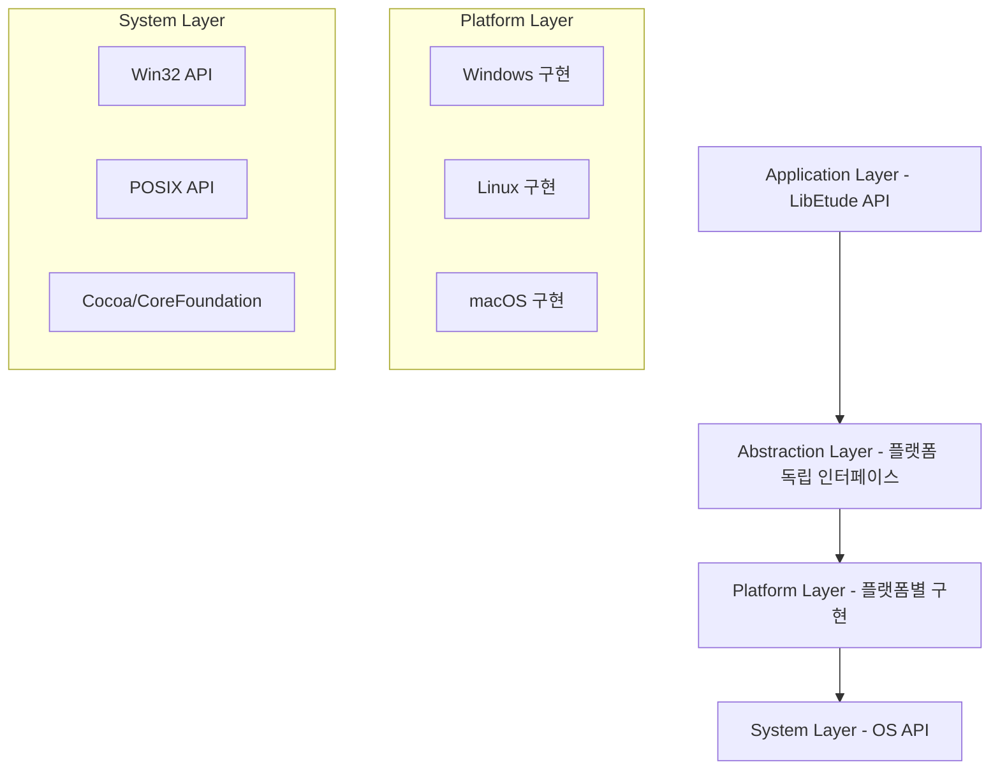

# 플랫폼 추상화 레이어 설계 문서

## 개요

LibEtude의 플랫폼 추상화 레이어는 Windows, Linux, macOS 등 다양한 플랫폼에서 일관된 API를 제공하기 위한 설계입니다. 이 레이어는 플랫폼별 구현 차이를 숨기고, 성능 최적화를 유지하면서도 코드 재사용성과 유지보수성을 향상시킵니다.

## 아키텍처

### 레이어드 아키텍처



### 핵심 설계 원칙

1. **인터페이스 기반 설계**: C 함수 포인터 구조체를 활용한 다형성 구현
2. **컴파일 타임 최적화**: 성능이 중요한 부분은 매크로와 인라인 함수 활용
3. **런타임 적응성**: 기능 감지 및 동적 디스패치 지원
4. **오류 처리 통합**: 플랫폼별 오류를 공통 오류 코드로 매핑
5. **확장성**: 새로운 플랫폼 추가 용이성

## 구성 요소 및 인터페이스

### 1. 오디오 I/O 추상화

#### 인터페이스 정의

```c
// include/libetude/platform/audio.h
typedef struct ETAudioInterface {
    // 디바이스 관리
    ETResult (*open_output_device)(const char* device_name, const ETAudioFormat* format, ETAudioDevice** device);
    ETResult (*open_input_device)(const char* device_name, const ETAudioFormat* format, ETAudioDevice** device);
    void (*close_device)(ETAudioDevice* device);

    // 스트림 제어
    ETResult (*start_stream)(ETAudioDevice* device);
    ETResult (*stop_stream)(ETAudioDevice* device);
    ETResult (*pause_stream)(ETAudioDevice* device);

    // 콜백 관리
    ETResult (*set_callback)(ETAudioDevice* device, ETAudioCallback callback, void* user_data);

    // 디바이스 정보
    ETResult (*enumerate_devices)(ETAudioDeviceType type, ETAudioDeviceInfo* devices, int* count);
    uint32_t (*get_latency)(const ETAudioDevice* device);
    ETAudioState (*get_state)(const ETAudioDevice* device);

    // 플랫폼별 확장
    void* platform_data;
} ETAudioInterface;
```

#### 플랫폼별 구현

- **Windows**: DirectSound/WASAPI 기반 구현
- **Linux**: ALSA 기반 구현
- **macOS**: CoreAudio 기반 구현

### 2. 시스템 정보 추상화

#### 인터페이스 정의

```c
// include/libetude/platform/system.h
typedef struct ETSystemInterface {
    // 시스템 정보
    ETResult (*get_system_info)(ETSystemInfo* info);
    ETResult (*get_memory_info)(ETMemoryInfo* info);
    ETResult (*get_cpu_info)(ETCPUInfo* info);

    // 타이머
    ETResult (*get_high_resolution_time)(uint64_t* time_ns);
    ETResult (*sleep)(uint32_t milliseconds);

    // 하드웨어 기능 감지
    uint32_t (*get_simd_features)(void);
    bool (*has_feature)(ETHardwareFeature feature);

    // 성능 모니터링
    ETResult (*get_cpu_usage)(float* usage_percent);
    ETResult (*get_memory_usage)(ETMemoryUsage* usage);

    void* platform_data;
} ETSystemInterface;
```

### 3. 스레딩 추상화

#### 인터페이스 정의

```c
// include/libetude/platform/threading.h
typedef struct ETThreadInterface {
    // 스레드 관리
    ETResult (*create_thread)(ETThread** thread, ETThreadFunc func, void* arg);
    ETResult (*join_thread)(ETThread* thread, void** result);
    ETResult (*detach_thread)(ETThread* thread);
    void (*destroy_thread)(ETThread* thread);

    // 스레드 속성
    ETResult (*set_thread_priority)(ETThread* thread, ETThreadPriority priority);
    ETResult (*set_thread_affinity)(ETThread* thread, int cpu_id);
    ETResult (*get_current_thread_id)(ETThreadID* id);

    // 동기화 프리미티브
    ETResult (*create_mutex)(ETMutex** mutex);
    ETResult (*lock_mutex)(ETMutex* mutex);
    ETResult (*unlock_mutex)(ETMutex* mutex);
    ETResult (*try_lock_mutex)(ETMutex* mutex);
    void (*destroy_mutex)(ETMutex* mutex);

    ETResult (*create_semaphore)(ETSemaphore** sem, int initial_count);
    ETResult (*wait_semaphore)(ETSemaphore* sem);
    ETResult (*post_semaphore)(ETSemaphore* sem);
    void (*destroy_semaphore)(ETSemaphore* sem);

    ETResult (*create_condition)(ETCondition** cond);
    ETResult (*wait_condition)(ETCondition* cond, ETMutex* mutex);
    ETResult (*signal_condition)(ETCondition* cond);
    ETResult (*broadcast_condition)(ETCondition* cond);
    void (*destroy_condition)(ETCondition* cond);

    void* platform_data;
} ETThreadInterface;
```

### 4. 메모리 관리 추상화

#### 인터페이스 정의

```c
// include/libetude/platform/memory.h
typedef struct ETMemoryInterface {
    // 기본 메모리 할당
    void* (*malloc)(size_t size);
    void* (*calloc)(size_t count, size_t size);
    void* (*realloc)(void* ptr, size_t size);
    void (*free)(void* ptr);

    // 정렬된 메모리 할당
    void* (*aligned_malloc)(size_t size, size_t alignment);
    void (*aligned_free)(void* ptr);

    // 메모리 페이지 관리
    ETResult (*lock_pages)(void* addr, size_t len);
    ETResult (*unlock_pages)(void* addr, size_t len);

    // 공유 메모리
    ETResult (*create_shared_memory)(const char* name, size_t size, ETSharedMemory** shm);
    ETResult (*open_shared_memory)(const char* name, ETSharedMemory** shm);
    void* (*map_shared_memory)(ETSharedMemory* shm);
    ETResult (*unmap_shared_memory)(ETSharedMemory* shm, void* addr);
    void (*destroy_shared_memory)(ETSharedMemory* shm);

    // 메모리 매핑 파일
    ETResult (*create_memory_map)(const char* filename, size_t size, ETMemoryMap** map);
    void* (*map_file)(ETMemoryMap* map, size_t offset, size_t length);
    ETResult (*unmap_file)(ETMemoryMap* map, void* addr, size_t length);
    void (*destroy_memory_map)(ETMemoryMap* map);

    void* platform_data;
} ETMemoryInterface;
```

### 5. 파일 시스템 추상화

#### 인터페이스 정의

```c
// include/libetude/platform/filesystem.h
typedef struct ETFilesystemInterface {
    // 경로 처리
    ETResult (*normalize_path)(const char* path, char* normalized, size_t size);
    ETResult (*join_path)(const char* base, const char* relative, char* result, size_t size);
    ETResult (*get_absolute_path)(const char* path, char* absolute, size_t size);

    // 파일 I/O
    ETResult (*open_file)(const char* path, ETFileMode mode, ETFile** file);
    ETResult (*read_file)(ETFile* file, void* buffer, size_t size, size_t* bytes_read);
    ETResult (*write_file)(ETFile* file, const void* buffer, size_t size, size_t* bytes_written);
    ETResult (*seek_file)(ETFile* file, int64_t offset, ETSeekOrigin origin);
    int64_t (*tell_file)(ETFile* file);
    void (*close_file)(ETFile* file);

    // 디렉토리 조작
    ETResult (*create_directory)(const char* path);
    ETResult (*remove_directory)(const char* path);
    ETResult (*list_directory)(const char* path, ETDirectoryEntry* entries, int* count);

    // 파일 속성
    ETResult (*get_file_info)(const char* path, ETFileInfo* info);
    ETResult (*set_file_permissions)(const char* path, ETFilePermissions permissions);
    bool (*file_exists)(const char* path);
    bool (*is_directory)(const char* path);

    void* platform_data;
} ETFilesystemInterface;
```

### 6. 네트워크 추상화

#### 인터페이스 정의

```c
// include/libetude/platform/network.h
typedef struct ETNetworkInterface {
    // 소켓 관리
    ETResult (*create_socket)(ETSocketType type, ETSocket** socket);
    ETResult (*bind_socket)(ETSocket* socket, const ETSocketAddress* addr);
    ETResult (*listen_socket)(ETSocket* socket, int backlog);
    ETResult (*accept_socket)(ETSocket* socket, ETSocket** client, ETSocketAddress* addr);
    ETResult (*connect_socket)(ETSocket* socket, const ETSocketAddress* addr);
    void (*close_socket)(ETSocket* socket);

    // 데이터 전송
    ETResult (*send_data)(ETSocket* socket, const void* data, size_t size, size_t* sent);
    ETResult (*receive_data)(ETSocket* socket, void* buffer, size_t size, size_t* received);

    // 소켓 옵션
    ETResult (*set_socket_option)(ETSocket* socket, ETSocketOption option, const void* value, size_t size);
    ETResult (*get_socket_option)(ETSocket* socket, ETSocketOption option, void* value, size_t* size);

    // 비동기 I/O
    ETResult (*create_io_context)(ETIOContext** context);
    ETResult (*register_socket)(ETIOContext* context, ETSocket* socket, ETIOEvents events);
    ETResult (*wait_events)(ETIOContext* context, ETIOEvent* events, int max_events, int timeout);
    void (*destroy_io_context)(ETIOContext* context);

    void* platform_data;
} ETNetworkInterface;
```

### 7. 동적 라이브러리 추상화

#### 인터페이스 정의

```c
// include/libetude/platform/dynlib.h
typedef struct ETDynlibInterface {
    // 라이브러리 로딩
    ETResult (*load_library)(const char* path, ETDynamicLibrary** lib);
    ETResult (*get_symbol)(ETDynamicLibrary* lib, const char* symbol_name, void** symbol);
    void (*unload_library)(ETDynamicLibrary* lib);

    // 오류 처리
    const char* (*get_last_error)(void);

    void* platform_data;
} ETDynlibInterface;
```

## 데이터 모델

### 공통 데이터 구조

```c
// 플랫폼 정보
typedef struct {
    ETPlatformType type;           // Windows, Linux, macOS 등
    char name[64];                 // 플랫폼 이름
    char version[32];              // 플랫폼 버전
    ETArchitecture arch;           // x86, x64, ARM 등
    uint32_t features;             // 지원 기능 플래그
} ETPlatformInfo;

// 시스템 정보
typedef struct {
    uint64_t total_memory;         // 총 메모리 (바이트)
    uint64_t available_memory;     // 사용 가능한 메모리
    uint32_t cpu_count;            // CPU 코어 수
    uint32_t cpu_frequency;        // CPU 주파수 (MHz)
    char cpu_name[128];            // CPU 이름
    char system_name[64];          // 시스템 이름
} ETSystemInfo;

// 오디오 디바이스 정보
typedef struct {
    char name[256];                // 디바이스 이름
    char id[128];                  // 디바이스 ID
    ETAudioDeviceType type;        // 입력/출력
    uint32_t max_channels;         // 최대 채널 수
    uint32_t* supported_rates;     // 지원 샘플 레이트 배열
    int rate_count;                // 샘플 레이트 개수
    bool is_default;               // 기본 디바이스 여부
} ETAudioDeviceInfo;
```

## 오류 처리

### 오류 매핑 시스템

```c
// 플랫폼별 오류를 공통 오류로 매핑
typedef struct {
    int platform_error;           // 플랫폼별 오류 코드
    ETResult common_error;        // 공통 오류 코드
    const char* description;      // 오류 설명
} ETErrorMapping;

// 오류 변환 함수
ETResult et_platform_error_to_common(ETPlatformType platform, int platform_error);
const char* et_get_platform_error_description(ETPlatformType platform, int platform_error);
```

### 상세 오류 정보

```c
typedef struct {
    ETResult code;                // 공통 오류 코드
    int platform_code;            // 플랫폼별 오류 코드
    char message[256];            // 오류 메시지
    const char* file;             // 발생 파일
    int line;                     // 발생 라인
    const char* function;         // 발생 함수
    uint64_t timestamp;           // 발생 시간
    ETPlatformType platform;     // 발생 플랫폼
} ETDetailedError;
```

## 테스팅 전략

### 1. 단위 테스트

- 각 플랫폼별 구현체에 대한 개별 테스트
- 인터페이스 계약 검증
- 오류 조건 테스트
- 성능 벤치마크

### 2. 통합 테스트

- 크로스 플랫폼 호환성 테스트
- 실제 하드웨어에서의 동작 검증
- 스트레스 테스트
- 메모리 누수 검사

### 3. 모킹 프레임워크

```c
// 테스트용 모킹 인터페이스
typedef struct {
    ETAudioInterface base;
    // 모킹 관련 데이터
    int call_count;
    ETResult return_value;
    void* expected_params;
} ETMockAudioInterface;
```

## 성능 최적화

### 1. 컴파일 타임 최적화

```c
// 플랫폼별 컴파일 타임 선택
#ifdef LIBETUDE_PLATFORM_WINDOWS
    #define ET_AUDIO_IMPL windows_audio_impl
#elif defined(LIBETUDE_PLATFORM_LINUX)
    #define ET_AUDIO_IMPL linux_audio_impl
#elif defined(LIBETUDE_PLATFORM_MACOS)
    #define ET_AUDIO_IMPL macos_audio_impl
#endif

// 인라인 함수를 통한 오버헤드 제거
LIBETUDE_INLINE ETResult et_audio_start_stream(ETAudioDevice* device) {
    return ET_AUDIO_IMPL.start_stream(device);
}
```

### 2. 런타임 최적화

```c
// 기능 캐싱
static uint32_t cached_simd_features = 0;
static bool features_cached = false;

uint32_t et_get_simd_features(void) {
    if (!features_cached) {
        cached_simd_features = platform_interface->get_simd_features();
        features_cached = true;
    }
    return cached_simd_features;
}
```

### 3. 메모리 최적화

- 구조체 패딩 최적화
- 메모리 풀 활용
- 지연 초기화
- 참조 카운팅

## 확장성 고려사항

### 1. 새로운 플랫폼 추가

1. 플랫폼별 구현 파일 생성
2. 인터페이스 구조체 구현
3. 팩토리 함수에 플랫폼 추가
4. 빌드 시스템 설정 업데이트

### 2. 새로운 기능 추가

1. 인터페이스에 함수 포인터 추가
2. 모든 플랫폼 구현체에 함수 구현
3. 기본 구현 제공 (선택사항)
4. 테스트 케이스 추가

### 3. 버전 호환성

```c
// 인터페이스 버전 관리
typedef struct {
    uint32_t version;             // 인터페이스 버전
    uint32_t size;                // 구조체 크기
    // ... 인터페이스 함수들
} ETVersionedInterface;

// 버전 호환성 검사
bool et_is_interface_compatible(uint32_t required_version, uint32_t provided_version);
```

이 설계는 LibEtude의 플랫폼 추상화 요구사항을 충족하면서도 성능과 확장성을 고려한 실용적인 접근 방식을 제공합니다.