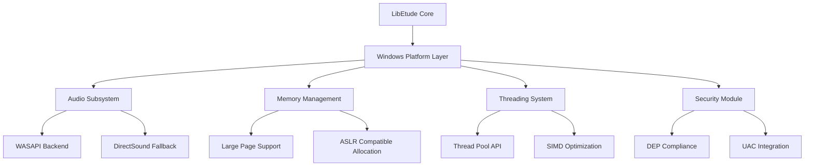

# Design Document

## Overview

LibEtude의 Windows 지원 강화는 Windows 플랫폼에서의 최적 성능과 네이티브 기능 활용을 목표로 합니다. 현재 기본적인 Windows 지원이 있지만, 이를 확장하여 Windows 특화 최적화, 보안 기능, 개발 도구 통합을 제공합니다.

## Architecture

### 1. 플랫폼 계층 구조

```
Windows Support Layer
├── Build System (CMake + MSVC/MinGW)
├── Audio Backend (WASAPI + DirectSound)
├── Security Integration (DEP, ASLR, UAC)
├── Development Tools (Visual Studio, ETW)
├── Distribution (NuGet, MSI)
└── Performance (SIMD, Threading, Large Pages)
```

### 2. 모듈 간 상호작용



## Components and Interfaces

### 1. Windows Build System Enhancement

**파일 위치**: `cmake/WindowsConfig.cmake`

```cmake
# Windows 특화 빌드 설정
function(configure_windows_build)
    # MSVC 최적화 플래그
    if(MSVC)
        target_compile_options(${TARGET_NAME} PRIVATE
            /O2 /Oi /Ot /Oy /GL /arch:AVX2
            /D_CRT_SECURE_NO_WARNINGS
            /DWIN32_LEAN_AND_MEAN
        )
        target_link_options(${TARGET_NAME} PRIVATE /LTCG)
    endif()

    # Windows SDK 링크
    target_link_libraries(${TARGET_NAME} PRIVATE
        kernel32 user32 ole32 oleaut32 uuid
        dsound winmm ksuser
    )
endfunction()
```

**인터페이스**: `include/libetude/platform/windows.h`

```c
typedef struct {
    bool use_wasapi;           // WASAPI 사용 여부
    bool enable_large_pages;   // Large Page 사용 여부
    bool enable_etw_logging;   // ETW 로깅 활성화
    DWORD thread_pool_min;     // 최소 스레드 풀 크기
    DWORD thread_pool_max;     // 최대 스레드 풀 크기
} ETWindowsConfig;

// Windows 플랫폼 초기화
ETResult et_windows_init(const ETWindowsConfig* config);
void et_windows_finalize(void);
```

### 2. Enhanced Audio Backend

**파일 위치**: `src/platform/windows/windows_audio_enhanced.c`

**WASAPI 우선 구현**:
```c
typedef struct {
    IMMDeviceEnumerator* device_enumerator;
    IMMDevice* audio_device;
    IAudioClient* audio_client;
    IAudioRenderClient* render_client;
    HANDLE audio_event;
    bool is_exclusive_mode;
} ETWASAPIContext;

// WASAPI 초기화 및 폴백 로직
ETResult et_audio_init_wasapi_with_fallback(ETAudioContext* ctx);
```

**DirectSound 폴백**:
```c
// 기존 DirectSound 구현 개선
ETResult et_audio_fallback_to_directsound(ETAudioContext* ctx);
```

### 3. Security Integration Module

**파일 위치**: `src/platform/windows/windows_security.c`

```c
// DEP 호환성 확인
bool et_windows_check_dep_compatibility(void);

// ASLR 호환 메모리 할당
void* et_windows_alloc_aslr_compatible(size_t size);

// UAC 권한 확인
bool et_windows_check_uac_permissions(void);
```

### 4. Development Tools Integration

**ETW (Event Tracing for Windows) 지원**:

**파일 위치**: `src/platform/windows/windows_etw.c`

```c
// ETW 프로바이더 등록
ETResult et_windows_register_etw_provider(void);

// 성능 이벤트 로깅
void et_windows_log_performance_event(const char* event_name,
                                    double duration_ms);

// 오류 이벤트 로깅
void et_windows_log_error_event(ETErrorCode error_code,
                               const char* description);
```

**Visual Studio 디버깅 지원**:

**파일 위치**: `cmake/VisualStudioConfig.cmake`

```cmake
# PDB 파일 생성 설정
if(MSVC AND CMAKE_BUILD_TYPE STREQUAL "Debug")
    target_compile_options(${TARGET_NAME} PRIVATE /Zi)
    target_link_options(${TARGET_NAME} PRIVATE /DEBUG:FULL)
endif()
```

### 5. Performance Optimization Module

**SIMD 최적화**:

**파일 위치**: `src/core/kernels/simd/windows_simd.c`

```c
// Windows에서 CPU 기능 감지
typedef struct {
    bool has_sse41;
    bool has_avx;
    bool has_avx2;
    bool has_avx512;
} ETWindowsCPUFeatures;

ETWindowsCPUFeatures et_windows_detect_cpu_features(void);

// AVX2/AVX-512 최적화된 커널
void et_windows_simd_matrix_multiply_avx2(const float* a, const float* b,
                                        float* c, int m, int n, int k);
```

**Thread Pool 통합**:

**파일 위치**: `src/platform/windows/windows_threading.c`

```c
// Windows Thread Pool API 래퍼
typedef struct {
    PTP_POOL thread_pool;
    PTP_CLEANUP_GROUP cleanup_group;
    TP_CALLBACK_ENVIRON callback_env;
} ETWindowsThreadPool;

ETResult et_windows_threadpool_init(ETWindowsThreadPool* pool,
                                  DWORD min_threads, DWORD max_threads);
```

**Large Page 지원**:

```c
// Large Page 메모리 할당
void* et_windows_alloc_large_pages(size_t size);
bool et_windows_enable_large_page_privilege(void);
```

### 6. Distribution and Integration

**NuGet 패키지 설정**:

**파일 위치**: `packaging/nuget/LibEtude.nuspec`

```xml
<?xml version="1.0" encoding="utf-8"?>
<package>
  <metadata>
    <id>LibEtude</id>
    <version>1.0.0</version>
    <title>LibEtude - AI Voice Synthesis Engine</title>
    <authors>LibEtude Project</authors>
    <description>Optimized AI inference engine for voice synthesis</description>
    <tags>ai voice synthesis tts</tags>
  </metadata>
  <files>
    <file src="lib\**\*" target="lib" />
    <file src="include\**\*" target="include" />
    <file src="tools\**\*" target="tools" />
  </files>
</package>
```

**CMake Config 파일**:

**파일 위치**: `cmake/LibEtudeConfig.cmake.in`

```cmake
# LibEtude CMake 설정 파일
set(LIBETUDE_VERSION @PROJECT_VERSION@)
set(LIBETUDE_INCLUDE_DIRS "@CMAKE_INSTALL_PREFIX@/include")
set(LIBETUDE_LIBRARIES "@CMAKE_INSTALL_PREFIX@/lib/libetude.lib")

# Windows 특화 설정
if(WIN32)
    set(LIBETUDE_WINDOWS_LIBRARIES
        kernel32 user32 ole32 dsound winmm)
endif()
```

## Data Models

### 1. Windows 설정 구조체

```c
typedef struct {
    // 오디오 설정
    struct {
        bool prefer_wasapi;
        DWORD buffer_size_ms;
        bool exclusive_mode;
    } audio;

    // 성능 설정
    struct {
        bool enable_large_pages;
        bool enable_avx_optimization;
        DWORD thread_pool_size;
    } performance;

    // 보안 설정
    struct {
        bool enforce_dep;
        bool require_aslr;
        bool check_uac;
    } security;

    // 개발 도구 설정
    struct {
        bool enable_etw_logging;
        bool generate_pdb;
        const char* log_file_path;
    } development;
} ETWindowsPlatformConfig;
```

### 2. 오디오 디바이스 정보

```c
typedef struct {
    wchar_t device_id[256];
    wchar_t friendly_name[256];
    DWORD sample_rate;
    WORD channels;
    WORD bits_per_sample;
    bool is_default;
    bool supports_exclusive;
} ETWindowsAudioDevice;
```

## Error Handling

### 1. Windows 특화 오류 코드

```c
typedef enum {
    ET_WINDOWS_ERROR_WASAPI_INIT_FAILED = 0x1000,
    ET_WINDOWS_ERROR_DIRECTSOUND_FALLBACK_FAILED,
    ET_WINDOWS_ERROR_LARGE_PAGE_PRIVILEGE_DENIED,
    ET_WINDOWS_ERROR_ETW_PROVIDER_REGISTRATION_FAILED,
    ET_WINDOWS_ERROR_THREAD_POOL_CREATION_FAILED,
    ET_WINDOWS_ERROR_SECURITY_CHECK_FAILED
} ETWindowsErrorCode;
```

### 2. 오류 처리 전략

- **WASAPI 실패 시**: DirectSound로 자동 폴백
- **Large Page 실패 시**: 일반 메모리 할당으로 폴백
- **ETW 등록 실패 시**: 파일 로깅으로 폴백
- **권한 부족 시**: 기능 비활성화 후 계속 실행

## Testing Strategy

### 1. 단위 테스트

**파일 위치**: `tests/unit/windows/`

- `test_windows_audio.c`: WASAPI/DirectSound 테스트
- `test_windows_security.c`: 보안 기능 테스트
- `test_windows_performance.c`: SIMD/Threading 테스트
- `test_windows_integration.c`: CMake/NuGet 통합 테스트

### 2. 통합 테스트

**파일 위치**: `tests/integration/windows/`

- Windows 10/11에서의 전체 워크플로우 테스트
- Visual Studio 2019/2022 빌드 테스트
- 다양한 오디오 디바이스에서의 테스트

### 3. 성능 테스트

**파일 위치**: `tests/performance/windows/`

- SIMD 최적화 성능 벤치마크
- Thread Pool vs 기본 스레딩 비교
- Large Page 메모리 할당 성능 측정

### 4. 호환성 테스트

- Windows 10 (1903 이상)
- Windows 11
- Windows Server 2019/2022
- Visual Studio 2019/2022
- MinGW-w64

## Implementation Notes

### 1. 빌드 시스템 개선사항

- CMake 3.16+ 요구사항 유지
- MSVC와 MinGW 모두 지원
- 자동 Windows SDK 감지
- NuGet 패키지 자동 생성

### 2. 성능 최적화 우선순위

1. WASAPI 저지연 오디오 출력
2. AVX2/AVX-512 SIMD 최적화
3. Windows Thread Pool 활용
4. Large Page 메모리 할당

### 3. 보안 고려사항

- 모든 메모리 할당은 ASLR 호환
- DEP 호환성 보장
- UAC 권한 최소화 원칙
- 코드 서명 지원 준비