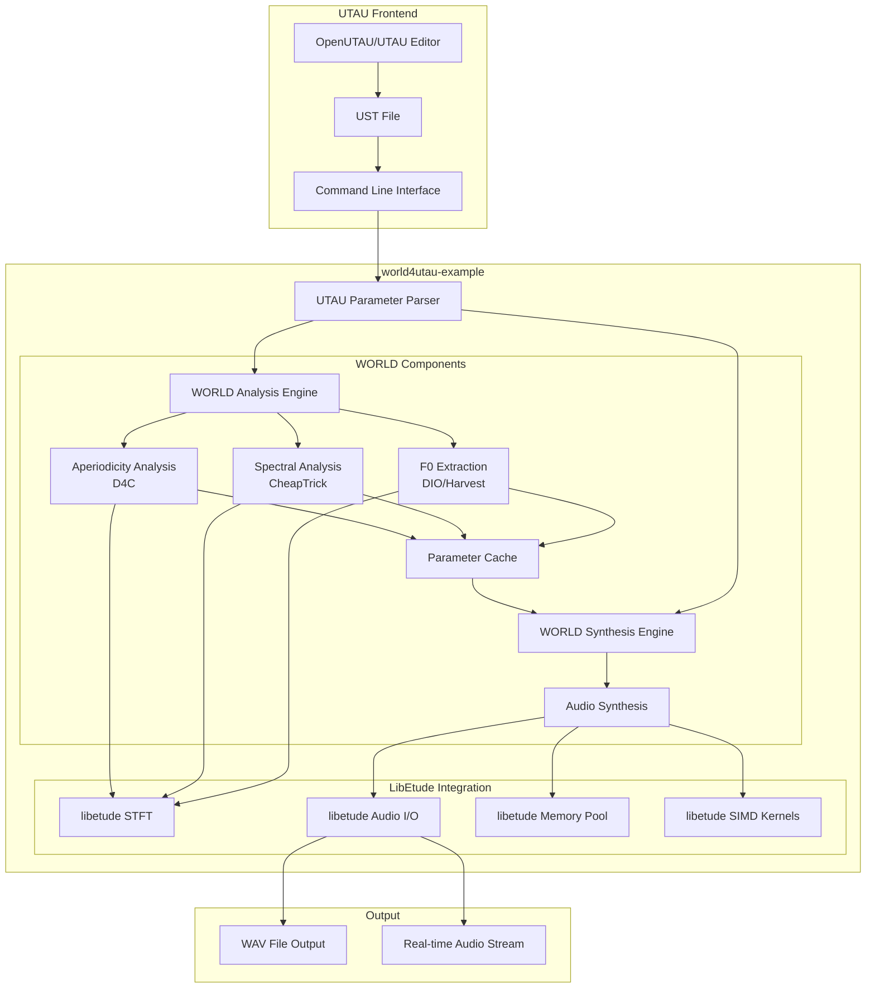

# 설계 문서

## Overview

world4utau-example은 libetude 라이브러리를 기반으로 한 UTAU 호환 음성 합성 엔진입니다. 이 프로젝트는 WORLD 보코더 알고리즘을 libetude의 최적화된 아키텍처에 통합하여 고성능 UTAU resampler를 구현합니다.

핵심 목표:
- WORLD 보코더 알고리즘의 libetude 기반 구현
- 기존 UTAU 도구들과의 완전한 호환성
- libetude의 SIMD 최적화 및 크로스 플랫폼 지원 활용
- 실시간 성능 최적화

## Architecture

### 전체 아키텍처



### 레이어 구조

1. **UTAU 호환 레이어**: 기존 UTAU 도구들과의 인터페이스
2. **WORLD 알고리즘 레이어**: F0, 스펙트럼, 비주기성 분석/합성
3. **libetude 통합 레이어**: 최적화된 DSP 및 메모리 관리
4. **플랫폼 추상화 레이어**: 크로스 플랫폼 지원

## Components and Interfaces

### 1. UTAU 호환 인터페이스

#### UTAUParameterParser
```c
typedef struct {
    char* input_wav_path;        // 입력 WAV 파일 경로
    char* output_wav_path;       // 출력 WAV 파일 경로
    float target_pitch;          // 목표 피치 (Hz)
    float velocity;              // 벨로시티 (0.0-1.0)
    float* pitch_bend;           // 피치 벤드 데이터
    int pitch_bend_length;       // 피치 벤드 길이
    float volume;                // 볼륨 (0.0-1.0)
    float modulation;            // 모듈레이션 강도
    float consonant_velocity;    // 자음 벨로시티
    float pre_utterance;         // 선행발성 (ms)
    float overlap;               // 오버랩 (ms)
    int sample_rate;             // 샘플링 레이트
} UTAUParameters;

// UTAU 명령줄 파라미터 파싱
ETResult parse_utau_parameters(int argc, char* argv[], UTAUParameters* params);

// UTAU 파라미터 유효성 검사
bool validate_utau_parameters(const UTAUParameters* params);
```

#### UTAU 명령줄 인터페이스
```bash
# 기본 사용법 (기존 world4utau와 동일)
world4utau input.wav output.wav target_pitch velocity [options]

# 예시
world4utau voice.wav output.wav 440.0 100 -p pitch_bend.txt -v 0.8
```

### 2. WORLD 알고리즘 구현

#### WorldAnalysisEngine
```c
typedef struct {
    // F0 추출 설정
    struct {
        double frame_period;     // 프레임 주기 (ms)
        double f0_floor;         // 최소 F0 (Hz)
        double f0_ceil;          // 최대 F0 (Hz)
        int algorithm;           // 0: DIO, 1: Harvest
    } f0_config;

    // 스펙트럼 분석 설정
    struct {
        double q1;               // CheapTrick Q1 파라미터
        int fft_size;            // FFT 크기
    } spectrum_config;

    // 비주기성 분석 설정
    struct {
        double threshold;        // D4C 임계값
    } aperiodicity_config;

    // libetude 통합
    ETSTFTContext* stft_ctx;     // STFT 컨텍스트
    ETMemoryPool* mem_pool;      // 메모리 풀
} WorldAnalysisEngine;

// WORLD 분석 엔진 생성
WorldAnalysisEngine* world_analysis_create(const WorldAnalysisConfig* config);

// 음성 분석 (F0, 스펙트럼, 비주기성 추출)
ETResult world_analyze_audio(WorldAnalysisEngine* engine,
                            const float* audio, int audio_length,
                            WorldParameters* params);

// 분석 엔진 해제
void world_analysis_destroy(WorldAnalysisEngine* engine);
```

#### WorldSynthesisEngine
```c
typedef struct {
    // 합성 설정
    struct {
        int sample_rate;         // 샘플링 레이트
        double frame_period;     // 프레임 주기
        bool enable_postfilter;  // 후처리 필터
    } synthesis_config;

    // libetude 통합
    ETVocoderContext* vocoder_ctx;  // 보코더 컨텍스트
    ETAudioBuffer* output_buffer;   // 출력 버퍼
    ETMemoryPool* mem_pool;         // 메모리 풀
} WorldSynthesisEngine;

// WORLD 합성 엔진 생성
WorldSynthesisEngine* world_synthesis_create(const WorldSynthesisConfig* config);

// 음성 합성
ETResult world_synthesize_audio(WorldSynthesisEngine* engine,
                               const WorldParameters* params,
                               float* output_audio, int* output_length);

// 실시간 합성 (스트리밍)
ETResult world_synthesize_streaming(WorldSynthesisEngine* engine,
                                   const WorldParameters* params,
                                   AudioStreamCallback callback, void* user_data);

// 합성 엔진 해제
void world_synthesis_destroy(WorldSynthesisEngine* engine);
```

### 3. libetude 통합 컴포넌트

#### 최적화된 FFT 통합
```c
// libetude STFT를 활용한 WORLD FFT 최적화
typedef struct {
    ETSTFTContext* stft_ctx;
    float* fft_buffer;
    float* window_buffer;
} WorldFFTContext;

// WORLD 알고리즘용 최적화된 FFT
ETResult world_fft_forward(WorldFFTContext* ctx, const float* input,
                          float* magnitude, float* phase);
ETResult world_fft_inverse(WorldFFTContext* ctx, const float* magnitude,
                          const float* phase, float* output);
```

#### 메모리 최적화
```c
// libetude 메모리 풀을 활용한 WORLD 메모리 관리
typedef struct {
    ETMemoryPool* analysis_pool;    // 분석용 메모리 풀
    ETMemoryPool* synthesis_pool;   // 합성용 메모리 풀
    ETMemoryPool* cache_pool;       // 캐시용 메모리 풀
} WorldMemoryManager;

// 메모리 관리자 생성
WorldMemoryManager* world_memory_create(size_t analysis_size,
                                        size_t synthesis_size,
                                        size_t cache_size);

// 메모리 할당/해제 (풀 기반)
void* world_memory_alloc(WorldMemoryManager* mgr, size_t size, int pool_type);
void world_memory_free(WorldMemoryManager* mgr, void* ptr, int pool_type);
```

### 4. 캐싱 시스템

#### 분석 결과 캐싱
```c
typedef struct {
    char file_hash[32];          // 파일 해시
    WorldParameters params;      // 분석 결과
    uint64_t timestamp;          // 캐시 생성 시간
    bool is_valid;               // 유효성 플래그
} WorldCacheEntry;

typedef struct {
    WorldCacheEntry* entries;    // 캐시 엔트리 배열
    int max_entries;             // 최대 엔트리 수
    int current_count;           // 현재 엔트리 수
    char cache_dir[256];         // 캐시 디렉토리
} WorldCache;

// 캐시 시스템 초기화
WorldCache* world_cache_create(const char* cache_dir, int max_entries);

// 캐시에서 분석 결과 조회
bool world_cache_get(WorldCache* cache, const char* file_path, WorldParameters* params);

// 캐시에 분석 결과 저장
ETResult world_cache_set(WorldCache* cache, const char* file_path, const WorldParameters* params);

// 캐시 정리
void world_cache_cleanup(WorldCache* cache, uint64_t max_age_seconds);
```

## Data Models

### WorldParameters 구조체
```c
typedef struct {
    // 기본 정보
    int sample_rate;             // 샘플링 레이트
    int audio_length;            // 오디오 길이 (샘플)
    double frame_period;         // 프레임 주기 (ms)
    int f0_length;               // F0 배열 길이
    int fft_size;                // FFT 크기

    // F0 정보
    double* f0;                  // F0 배열 (Hz)
    double* time_axis;           // 시간축 배열 (초)

    // 스펙트럼 정보
    double** spectrogram;        // 스펙트로그램 [f0_length][fft_size/2+1]

    // 비주기성 정보
    double** aperiodicity;       // 비주기성 [f0_length][fft_size/2+1]

    // 메모리 관리
    bool owns_memory;            // 메모리 소유권
    ETMemoryPool* mem_pool;      // 메모리 풀 참조
} WorldParameters;

// WorldParameters 생성/해제
WorldParameters* world_parameters_create(int f0_length, int fft_size, ETMemoryPool* pool);
void world_parameters_destroy(WorldParameters* params);

// 메모리 효율적인 복사
ETResult world_parameters_copy(const WorldParameters* src, WorldParameters* dst);
```

### UTAU-WORLD 파라미터 매핑
```c
typedef struct {
    // UTAU 파라미터
    UTAUParameters utau;

    // WORLD 파라미터
    WorldParameters world;

    // 매핑 정보
    struct {
        float pitch_scale;       // 피치 스케일링 팩터
        float time_scale;        // 시간 스케일링 팩터
        float volume_scale;      // 볼륨 스케일링 팩터
    } mapping;
} UTAUWorldMapping;

// UTAU 파라미터를 WORLD 파라미터로 변환
ETResult convert_utau_to_world(const UTAUParameters* utau, WorldParameters* world);

// 피치 벤드 적용
ETResult apply_pitch_bend(WorldParameters* world, const float* pitch_bend, int length);

// 볼륨 및 모듈레이션 적용
ETResult apply_volume_modulation(WorldParameters* world, float volume, float modulation);
```

## Error Handling

### 에러 코드 정의
```c
// world4utau 전용 에러 코드 (libetude 에러 시스템 확장)
typedef enum {
    ET_WORLD_SUCCESS = 0,
    ET_WORLD_ERROR_INVALID_AUDIO = -1000,
    ET_WORLD_ERROR_ANALYSIS_FAILED = -1001,
    ET_WORLD_ERROR_SYNTHESIS_FAILED = -1002,
    ET_WORLD_ERROR_INVALID_PARAMETERS = -1003,
    ET_WORLD_ERROR_CACHE_FAILED = -1004,
    ET_WORLD_ERROR_UTAU_PARSE_FAILED = -1005,
    ET_WORLD_ERROR_FILE_IO = -1006,
    ET_WORLD_ERROR_MEMORY_ALLOCATION = -1007
} WorldErrorCode;

// 에러 핸들링 함수
const char* world_get_error_string(WorldErrorCode error);
void world_set_error_callback(ETErrorCallback callback, void* user_data);
```

### 로깅 시스템
```c
// world4utau 전용 로그 카테고리
typedef enum {
    WORLD_LOG_ANALYSIS,
    WORLD_LOG_SYNTHESIS,
    WORLD_LOG_CACHE,
    WORLD_LOG_UTAU_INTERFACE,
    WORLD_LOG_PERFORMANCE
} WorldLogCategory;

// 로깅 매크로
#define WORLD_LOG_INFO(category, ...) \
    et_log(ET_LOG_INFO, "[WORLD:" #category "] " __VA_ARGS__)

#define WORLD_LOG_ERROR(category, ...) \
    et_log(ET_LOG_ERROR, "[WORLD:" #category "] " __VA_ARGS__)

#define WORLD_LOG_DEBUG(category, ...) \
    et_log(ET_LOG_DEBUG, "[WORLD:" #category "] " __VA_ARGS__)
```

## Testing Strategy

### 단위 테스트

#### WORLD 알고리즘 테스트
```c
// F0 추출 정확성 테스트
void test_f0_extraction_accuracy(void);
void test_f0_extraction_performance(void);

// 스펙트럼 분석 테스트
void test_spectrum_analysis_accuracy(void);
void test_spectrum_analysis_simd_optimization(void);

// 비주기성 분석 테스트
void test_aperiodicity_analysis_accuracy(void);

// 합성 품질 테스트
void test_synthesis_quality(void);
void test_synthesis_realtime_performance(void);
```

#### libetude 통합 테스트
```c
// STFT 통합 테스트
void test_world_stft_integration(void);

// 메모리 풀 통합 테스트
void test_world_memory_pool_integration(void);

// 오디오 I/O 통합 테스트
void test_world_audio_io_integration(void);
```

### 통합 테스트

#### UTAU 호환성 테스트
```c
// 명령줄 인터페이스 테스트
void test_utau_command_line_compatibility(void);

// 파라미터 파싱 테스트
void test_utau_parameter_parsing(void);

// 파일 I/O 호환성 테스트
void test_utau_file_io_compatibility(void);
```

#### 성능 테스트
```c
// 실시간 성능 테스트
void test_realtime_performance_requirements(void);

// 메모리 사용량 테스트
void test_memory_usage_optimization(void);

// 크로스 플랫폼 성능 테스트
void test_cross_platform_performance(void);
```

### 벤치마크 테스트

#### 성능 비교 테스트
```c
// 기존 world4utau와의 성능 비교
void benchmark_against_original_world4utau(void);

// libetude 최적화 효과 측정
void benchmark_libetude_optimization_impact(void);

// 플랫폼별 성능 측정
void benchmark_platform_specific_performance(void);
```

#### 품질 평가 테스트
```c
// 음성 품질 객관적 평가 (PESQ, STOI 등)
void evaluate_audio_quality_objective(void);

// 기존 world4utau와의 품질 비교
void compare_audio_quality_with_original(void);
```

### 테스트 데이터

#### 테스트 음성 샘플
- 다양한 언어 (일본어, 영어, 한국어)
- 다양한 음성 특성 (남성/여성, 높은/낮은 피치)
- 다양한 길이 (짧은 음소부터 긴 문장까지)

#### UTAU 테스트 케이스
- 기본 UTAU 파라미터 조합
- 극한 파라미터 값 테스트
- 실제 UTAU 프로젝트 파일 테스트

#### 성능 테스트 시나리오
- 실시간 처리 요구사항 (100ms 이내)
- 배치 처리 최적화
- 메모리 제한 환경 테스트