# LibEtude 내부 아키텍처 문서

## 개요

LibEtude는 음성 합성에 특화된 AI 추론 엔진으로, 계층적 모듈 아키텍처를 통해 고성능과 확장성을 동시에 제공합니다. 이 문서는 LibEtude의 내부 구조, 컴포넌트 간 상호작용, 데이터 흐름, 그리고 확장 방법에 대해 상세히 설명합니다.

## 전체 아키텍처 개요

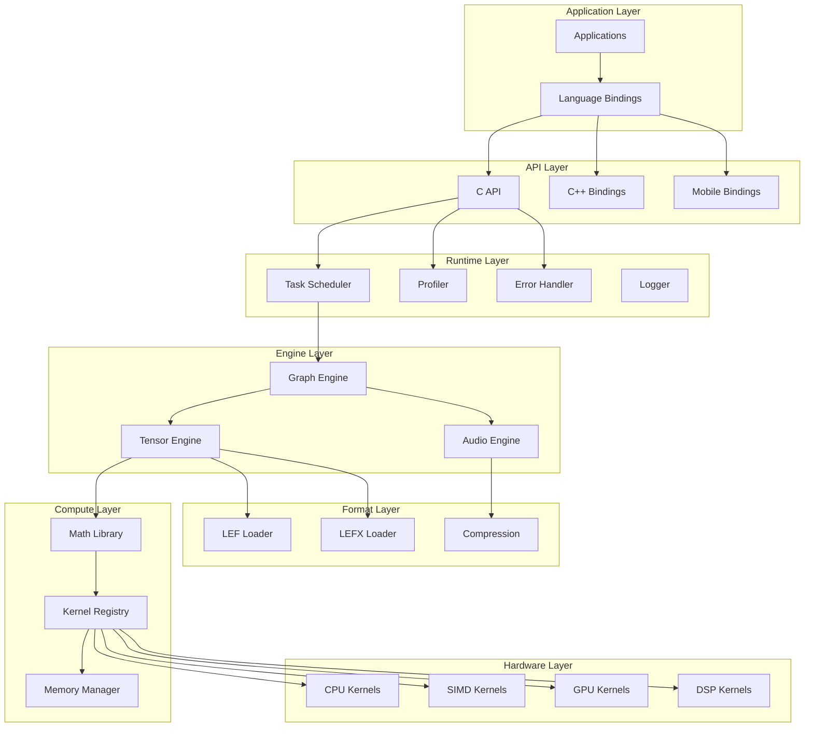

## 계층별 상세 설명

### 1. 하드웨어 계층 (Hardware Layer)

하드웨어 계층은 다양한 하드웨어 플랫폼에 최적화된 저수준 연산을 제공합니다.

#### 1.1 커널 아키텍처

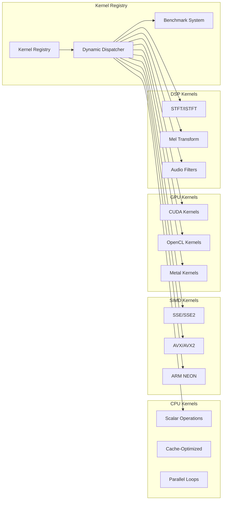

#### 커널 등록 및 선택 메커니즘

```c
// 커널 등록 구조체
typedef struct {
    const char* name;                    // 커널 이름
    void (*kernel_func)(void* params);   // 커널 함수 포인터
    uint32_t hw_requirements;            // 하드웨어 요구사항
    size_t optimal_size;                 // 최적 데이터 크기
    int priority;                        // 우선순위
    float (*benchmark_func)(void);       // 벤치마크 함수
} KernelDescriptor;

// 커널 레지스트리
typedef struct {
    KernelDescriptor* kernels[MAX_KERNELS];
    int kernel_count;
    uint32_t hw_features;                // 현재 하드웨어 기능
    KernelDescriptor* selected_kernels[MAX_OP_TYPES];
} KernelRegistry;

// 커널 선택 알고리즘
KernelDescriptor* select_optimal_kernel(const char* op_name,
                                       size_t data_size,
                                       KernelRegistry* registry) {
    KernelDescriptor* best_kernel = NULL;
    float best_score = 0.0f;

    for (int i = 0; i < registry->kernel_count; i++) {
        KernelDescriptor* kernel = registry->kernels[i];

        // 이름 매칭
        if (strcmp(kernel->name, op_name) != 0) continue;

        // 하드웨어 요구사항 확인
        if ((kernel->hw_requirements & registry->hw_features) !=
            kernel->hw_requirements) continue;

        // 벤치마크 점수 계산
        float score = kernel->benchmark_func();

        // 데이터 크기에 따른 가중치 적용
        if (data_size >= kernel->optimal_size) {
            score *= 1.2f;  // 최적 크기 이상이면 보너스
        }

        if (score > best_score) {
            best_score = score;
            best_kernel = kernel;
        }
    }

    return best_kernel;
}
```

### 2. 컴퓨트 계층 (Compute Layer)

컴퓨트 계층은 수학 연산, 메모리 관리, 커널 디스패치를 담당합니다.

#### 2.1 메모리 관리 아키텍처

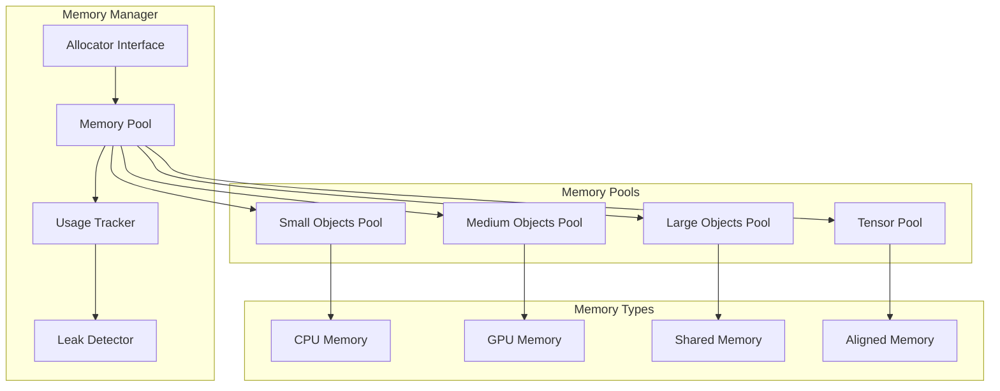

#### 메모리 풀 구현

```c
// 메모리 풀 구조체
typedef struct {
    void* base_ptr;           // 기본 메모리 주소
    size_t total_size;        // 총 크기
    size_t block_size;        // 블록 크기
    size_t alignment;         // 정렬 요구사항

    // 자유 블록 관리
    void** free_list;         // 자유 블록 리스트
    int free_count;           // 자유 블록 수

    // 통계
    size_t allocated_blocks;  // 할당된 블록 수
    size_t peak_usage;        // 피크 사용량

    // 동기화
    pthread_mutex_t mutex;    // 스레드 안전성
} MemoryPool;

// 메모리 풀에서 할당
void* memory_pool_alloc(MemoryPool* pool) {
    pthread_mutex_lock(&pool->mutex);

    if (pool->free_count == 0) {
        pthread_mutex_unlock(&pool->mutex);
        return NULL;  // 풀이 가득 참
    }

    // 자유 블록에서 가져오기
    void* ptr = pool->free_list[--pool->free_count];
    pool->allocated_blocks++;

    // 피크 사용량 업데이트
    if (pool->allocated_blocks > pool->peak_usage) {
        pool->peak_usage = pool->allocated_blocks;
    }

    pthread_mutex_unlock(&pool->mutex);
    return ptr;
}

// 메모리 풀에 반환
void memory_pool_free(MemoryPool* pool, void* ptr) {
    if (!ptr) return;

    pthread_mutex_lock(&pool->mutex);

    // 자유 블록 리스트에 추가
    pool->free_list[pool->free_count++] = ptr;
    pool->allocated_blocks--;

    pthread_mutex_unlock(&pool->mutex);
}
```

#### 2.2 고속 수학 라이브러리

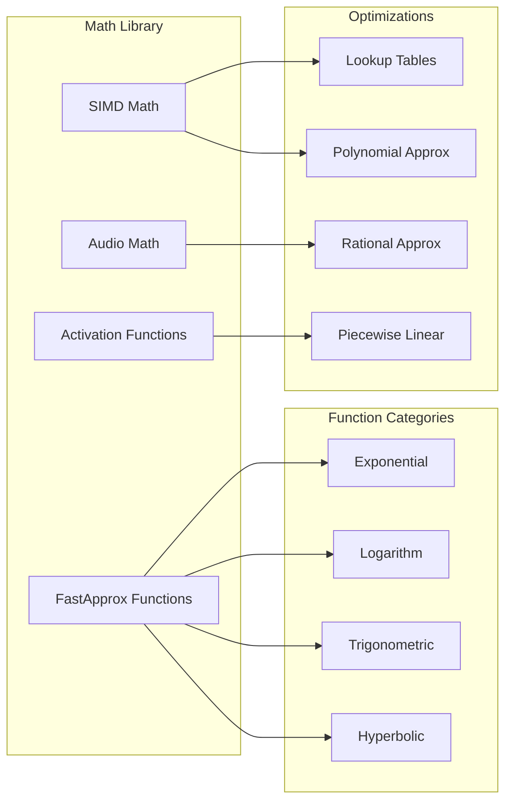

### 3. 포맷 계층 (Format Layer)

포맷 계층은 모델 직렬화, 압축, 로딩을 담당합니다.

#### 3.1 LEF 포맷 구조

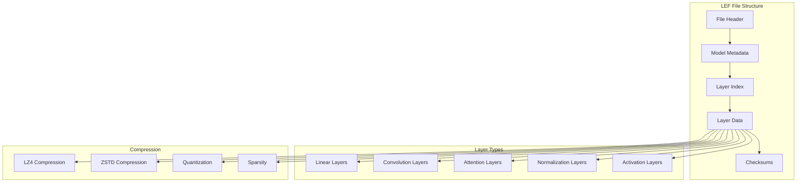

#### LEF 파일 로더 구현

```c
// LEF 로더 구조체
typedef struct {
    FILE* file;                    // 파일 핸들
    LEFHeader header;              // 파일 헤더
    LEFModelMeta meta;             // 모델 메타데이터
    LEFLayerHeader* layer_index;   // 레이어 인덱스

    // 캐싱
    void** layer_cache;            // 레이어 캐시
    bool* cache_valid;             // 캐시 유효성
    size_t cache_size;             // 캐시 크기

    // 스트리밍
    bool streaming_mode;           // 스트리밍 모드
    pthread_t loader_thread;       // 로더 스레드

    // 메모리 관리
    MemoryPool* mem_pool;          // 메모리 풀
} LEFLoader;

// 레이어 온디맨드 로딩
int lef_load_layer_on_demand(LEFLoader* loader, int layer_id) {
    if (layer_id < 0 || layer_id >= loader->meta.num_layers) {
        return ET_ERROR_INVALID_ARGUMENT;
    }

    // 캐시 확인
    if (loader->cache_valid[layer_id]) {
        return ET_SUCCESS;  // 이미 로드됨
    }

    LEFLayerHeader* layer_header = &loader->layer_index[layer_id];

    // 파일에서 레이어 데이터 읽기
    fseek(loader->file, layer_header->data_offset, SEEK_SET);

    void* compressed_data = malloc(layer_header->compressed_size);
    if (!compressed_data) {
        return ET_ERROR_OUT_OF_MEMORY;
    }

    size_t read_size = fread(compressed_data, 1, layer_header->compressed_size,
                            loader->file);
    if (read_size != layer_header->compressed_size) {
        free(compressed_data);
        return ET_ERROR_IO;
    }

    // 압축 해제
    void* layer_data = memory_pool_alloc(loader->mem_pool);
    if (!layer_data) {
        free(compressed_data);
        return ET_ERROR_OUT_OF_MEMORY;
    }

    int decompress_result = decompress_layer_data(
        compressed_data, layer_header->compressed_size,
        layer_data, layer_header->data_size
    );

    free(compressed_data);

    if (decompress_result != ET_SUCCESS) {
        memory_pool_free(loader->mem_pool, layer_data);
        return decompress_result;
    }

    // 체크섬 검증
    uint32_t calculated_checksum = calculate_checksum(layer_data,
                                                     layer_header->data_size);
    if (calculated_checksum != layer_header->checksum) {
        memory_pool_free(loader->mem_pool, layer_data);
        return ET_ERROR_MODEL;
    }

    // 캐시에 저장
    loader->layer_cache[layer_id] = layer_data;
    loader->cache_valid[layer_id] = true;

    return ET_SUCCESS;
}
```

#### 3.2 LEFX 확장 모델 시스템

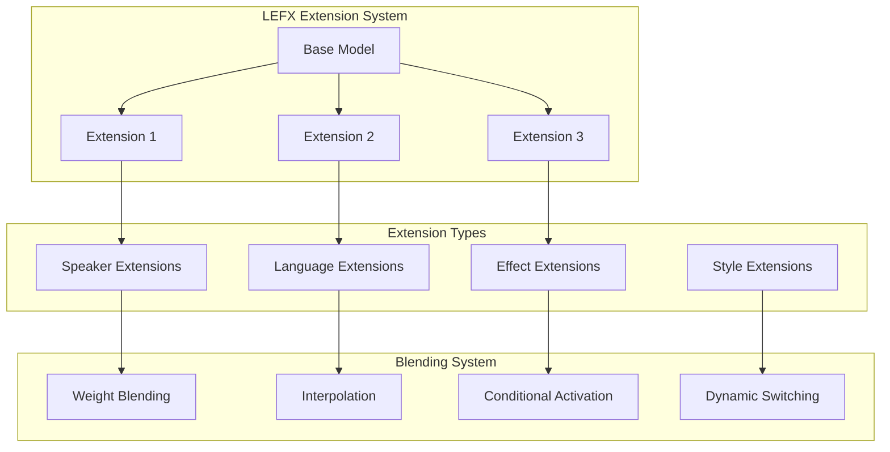

### 4. 엔진 계층 (Engine Layer)

엔진 계층은 텐서 연산, 그래프 실행, 오디오 처리를 담당합니다.

#### 4.1 텐서 엔진 아키텍처

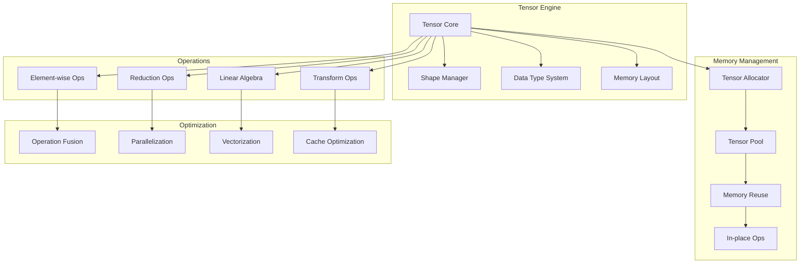

#### 텐서 구현

```c
// 텐서 구조체
typedef struct {
    void* data;                    // 데이터 포인터
    size_t* shape;                 // 형태 (각 차원의 크기)
    size_t* strides;               // 스트라이드
    size_t ndim;                   // 차원 수
    size_t size;                   // 총 요소 수
    ETDataType dtype;              // 데이터 타입
    ETMemoryType mem_type;         // 메모리 타입

    // 메모리 관리
    MemoryPool* pool;              // 할당된 메모리 풀
    bool owns_data;                // 데이터 소유권

    // 최적화 정보
    bool is_contiguous;            // 연속 메모리 여부
    size_t alignment;              // 메모리 정렬

    // 참조 카운팅
    int ref_count;                 // 참조 카운트
    pthread_mutex_t ref_mutex;     // 참조 카운트 뮤텍스
} ETTensor;

// 텐서 생성
ETTensor* et_create_tensor(MemoryPool* pool, ETDataType dtype,
                          size_t ndim, size_t* shape) {
    ETTensor* tensor = calloc(1, sizeof(ETTensor));
    if (!tensor) return NULL;

    // 형태 및 스트라이드 계산
    tensor->shape = malloc(ndim * sizeof(size_t));
    tensor->strides = malloc(ndim * sizeof(size_t));

    if (!tensor->shape || !tensor->strides) {
        free(tensor->shape);
        free(tensor->strides);
        free(tensor);
        return NULL;
    }

    // 형태 복사 및 크기 계산
    tensor->size = 1;
    for (size_t i = 0; i < ndim; i++) {
        tensor->shape[i] = shape[i];
        tensor->size *= shape[i];
    }

    // 스트라이드 계산 (C-order)
    tensor->strides[ndim - 1] = 1;
    for (int i = ndim - 2; i >= 0; i--) {
        tensor->strides[i] = tensor->strides[i + 1] * tensor->shape[i + 1];
    }

    tensor->ndim = ndim;
    tensor->dtype = dtype;
    tensor->pool = pool;
    tensor->owns_data = true;
    tensor->is_contiguous = true;
    tensor->ref_count = 1;

    // 데이터 할당
    size_t data_size = tensor->size * get_dtype_size(dtype);
    tensor->data = memory_pool_alloc_aligned(pool, data_size, 32);

    if (!tensor->data) {
        free(tensor->shape);
        free(tensor->strides);
        free(tensor);
        return NULL;
    }

    pthread_mutex_init(&tensor->ref_mutex, NULL);

    return tensor;
}
```

#### 4.2 그래프 실행 엔진

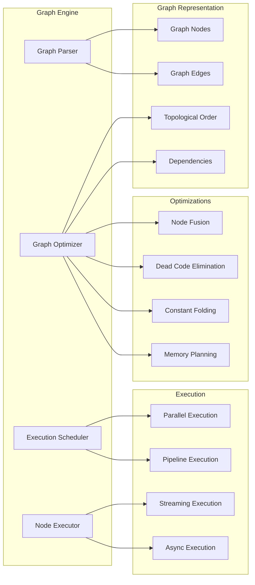

#### 그래프 노드 구현

```c
// 그래프 노드 구조체
typedef struct ETNode {
    char* name;                    // 노드 이름
    char* op_type;                 // 연산자 타입

    // 입출력
    ETTensor** inputs;             // 입력 텐서들
    size_t num_inputs;             // 입력 개수
    ETTensor** outputs;            // 출력 텐서들
    size_t num_outputs;            // 출력 개수

    // 그래프 연결
    struct ETNode** input_nodes;   // 입력 노드들
    size_t num_input_nodes;        // 입력 노드 개수
    struct ETNode** output_nodes;  // 출력 노드들
    size_t num_output_nodes;       // 출력 노드 개수

    // 연산자 정보
    void* attributes;              // 연산자 속성
    void (*forward)(struct ETNode*); // 순방향 함수

    // 실행 정보
    bool is_ready;                 // 실행 준비 상태
    bool is_executed;              // 실행 완료 상태
    int execution_order;           // 실행 순서

    // 최적화 정보
    bool can_fuse;                 // 융합 가능 여부
    bool is_constant;              // 상수 노드 여부

    // 프로파일링
    uint64_t execution_time;       // 실행 시간
    size_t memory_usage;           // 메모리 사용량
} ETNode;

// 그래프 실행
int et_execute_graph(ETGraph* graph, ETTensor** inputs, ETTensor** outputs) {
    // 토폴로지 정렬
    int* execution_order = topological_sort(graph);
    if (!execution_order) {
        return ET_ERROR_GRAPH;
    }

    // 입력 텐서 설정
    for (size_t i = 0; i < graph->num_input_nodes; i++) {
        ETNode* input_node = graph->input_nodes[i];
        input_node->outputs[0] = inputs[i];
        input_node->is_executed = true;
    }

    // 노드별 실행
    for (int i = 0; i < graph->num_nodes; i++) {
        int node_idx = execution_order[i];
        ETNode* node = graph->nodes[node_idx];

        // 입력 노드는 이미 실행됨
        if (node->is_executed) continue;

        // 의존성 확인
        bool dependencies_ready = true;
        for (size_t j = 0; j < node->num_input_nodes; j++) {
            if (!node->input_nodes[j]->is_executed) {
                dependencies_ready = false;
                break;
            }
        }

        if (!dependencies_ready) {
            free(execution_order);
            return ET_ERROR_GRAPH;
        }

        // 노드 실행
        uint64_t start_time = get_current_time_us();
        node->forward(node);
        uint64_t end_time = get_current_time_us();

        node->execution_time = end_time - start_time;
        node->is_executed = true;
    }

    // 출력 텐서 설정
    for (size_t i = 0; i < graph->num_output_nodes; i++) {
        ETNode* output_node = graph->output_nodes[i];
        outputs[i] = output_node->outputs[0];
    }

    free(execution_order);
    return ET_SUCCESS;
}
```

### 5. 런타임 계층 (Runtime Layer)

런타임 계층은 작업 스케줄링, 프로파일링, 오류 처리를 담당합니다.

#### 5.1 작업 스케줄러 아키텍처

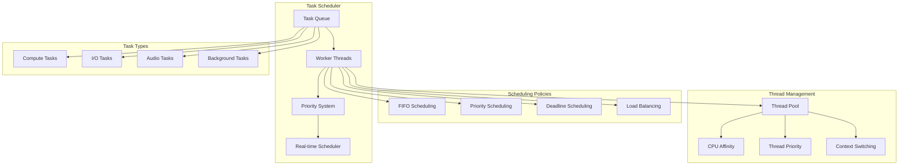

#### 작업 스케줄러 구현

```c
// 작업 구조체
typedef struct {
    int id;                        // 작업 ID
    int priority;                  // 우선순위 (높을수록 우선)
    uint64_t deadline;             // 데드라인 (마이크로초)

    void (*task_func)(void*);      // 작업 함수
    void* task_data;               // 작업 데이터

    // 콜백
    void (*completion_callback)(int task_id, int result);

    // 상태
    TaskState state;               // 작업 상태
    uint64_t submit_time;          // 제출 시간
    uint64_t start_time;           // 시작 시간
    uint64_t end_time;             // 완료 시간
} Task;

// 스케줄러 구조체
typedef struct {
    // 작업 큐
    Task** task_queue;             // 작업 큐
    int queue_capacity;            // 큐 용량
    int queue_size;                // 현재 큐 크기
    int queue_head;                // 큐 헤드
    int queue_tail;                // 큐 테일

    // 워커 스레드
    pthread_t* worker_threads;     // 워커 스레드 배열
    int num_workers;               // 워커 수
    bool shutdown;                 // 종료 플래그

    // 실시간 스케줄링
    bool realtime_mode;            // 실시간 모드
    uint64_t audio_deadline;       // 오디오 데드라인

    // 동기화
    pthread_mutex_t queue_mutex;   // 큐 뮤텍스
    pthread_cond_t work_available; // 작업 가용 조건변수
    pthread_cond_t queue_not_full; // 큐 여유 조건변수

    // 통계
    uint64_t total_tasks;          // 총 작업 수
    uint64_t completed_tasks;      // 완료된 작업 수
    uint64_t missed_deadlines;     // 놓친 데드라인 수
} TaskScheduler;

// 워커 스레드 함수
void* worker_thread_func(void* arg) {
    TaskScheduler* scheduler = (TaskScheduler*)arg;

    while (!scheduler->shutdown) {
        pthread_mutex_lock(&scheduler->queue_mutex);

        // 작업이 없으면 대기
        while (scheduler->queue_size == 0 && !scheduler->shutdown) {
            pthread_cond_wait(&scheduler->work_available, &scheduler->queue_mutex);
        }

        if (scheduler->shutdown) {
            pthread_mutex_unlock(&scheduler->queue_mutex);
            break;
        }

        // 우선순위가 가장 높은 작업 선택
        Task* task = dequeue_highest_priority_task(scheduler);

        pthread_mutex_unlock(&scheduler->queue_mutex);

        if (task) {
            // 작업 실행
            task->start_time = get_current_time_us();
            task->state = TASK_RUNNING;

            task->task_func(task->task_data);

            task->end_time = get_current_time_us();
            task->state = TASK_COMPLETED;

            // 데드라인 체크
            if (task->deadline > 0 && task->end_time > task->deadline) {
                scheduler->missed_deadlines++;
            }

            // 완료 콜백 호출
            if (task->completion_callback) {
                task->completion_callback(task->id, ET_SUCCESS);
            }

            scheduler->completed_tasks++;
            free(task);
        }
    }

    return NULL;
}
```

#### 5.2 성능 프로파일러

```mermaid
graph TB
    subgraph "Performance Profiler"
        COLLECTOR[Data Collector]
        ANALYZER[Performance Analyzer]
        REPORTER[Report Generator]
        MONITOR[Real-time Monitor]
    end

    subgraph "Metrics"
        TIME[Execution Time]
        MEMORY[Memory Usage]
        CPU[CPU Usage]
        GPU[GPU Usage]
        THROUGHPUT[Throughput]
        LATENCY[Latency]
    end

    subgraph "Collection Methods"
        SAMPLING[Sampling]
        INSTRUMENTATION[Instrumentation]
        HARDWARE_COUNTERS[Hardware Counters]
        OS_METRICS[OS Metrics]
    end

    subgraph "Analysis"
        BOTTLENECK[Bottleneck Analysis]
        TREND[Trend Analysis]
        COMPARISON[Comparison]
        OPTIMIZATION[Optimization Hints]
    end

    COLLECTOR --> TIME
    COLLECTOR --> MEMORY
    COLLECTOR --> CPU
    COLLECTOR --> GPU
    COLLECTOR --> THROUGHPUT
    COLLECTOR --> LATENCY

    COLLECTOR --> SAMPLING
    COLLECTOR --> INSTRUMENTATION
    COLLECTOR --> HARDWARE_COUNTERS
    COLLECTOR --> OS_METRICS

    ANALYZER --> BOTTLENECK
    ANALYZER --> TREND
    ANALYZER --> COMPARISON
    ANALYZER --> OPTIMIZATION
```

## 데이터 흐름 다이어그램

### 음성 합성 파이프라인

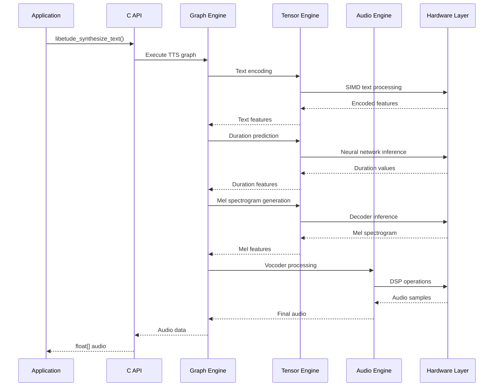

### 스트리밍 처리 흐름

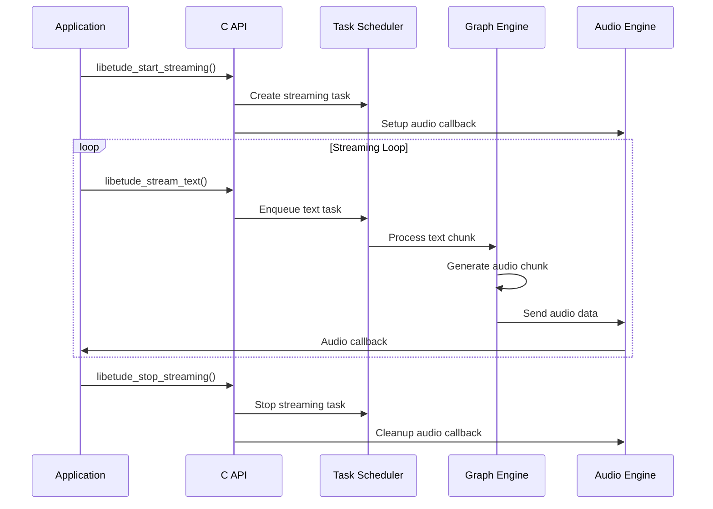

## 확장 가이드

### 새로운 연산자 추가

1. **연산자 인터페이스 정의**
```c
// 새로운 연산자 구조체
typedef struct {
    // 연산자별 속성
    float custom_param;
    int mode;
} CustomOpAttributes;

// 순방향 함수
void custom_op_forward(ETNode* node) {
    CustomOpAttributes* attrs = (CustomOpAttributes*)node->attributes;
    ETTensor* input = node->inputs[0];
    ETTensor* output = node->outputs[0];

    // 커스텀 연산 구현
    custom_operation(input->data, output->data,
                    input->size, attrs->custom_param);
}
```

2. **연산자 등록**
```c
// 연산자 등록
ETOperator custom_op = {
    .name = "CustomOp",
    .create = custom_op_create,
    .forward = custom_op_forward,
    .destroy = custom_op_destroy
};

et_register_operator(&global_operator_registry, &custom_op);
```

### 새로운 커널 추가

1. **커널 구현**
```c
// SIMD 최적화된 커널
void custom_simd_kernel(float* input, float* output, size_t size) {
    #ifdef __AVX2__
    // AVX2 구현
    for (size_t i = 0; i < size; i += 8) {
        __m256 vec = _mm256_load_ps(&input[i]);
        __m256 result = _mm256_custom_operation_ps(vec);
        _mm256_store_ps(&output[i], result);
    }
    #else
    // 스칼라 구현
    for (size_t i = 0; i < size; i++) {
        output[i] = custom_scalar_operation(input[i]);
    }
    #endif
}
```

2. **커널 등록**
```c
// 커널 디스크립터
KernelDescriptor custom_kernel = {
    .name = "custom_operation",
    .kernel_func = (void(*)(void*))custom_simd_kernel,
    .hw_requirements = LIBETUDE_SIMD_AVX2,
    .optimal_size = 1024,
    .priority = 10,
    .benchmark_func = benchmark_custom_kernel
};

register_kernel(&global_kernel_registry, &custom_kernel);
```

### 새로운 데이터 타입 추가

1. **데이터 타입 정의**
```c
// 새로운 데이터 타입 추가
typedef enum {
    // 기존 타입들...
    ET_CUSTOM_TYPE = 10
} ETDataType;

// 타입별 크기 함수 확장
size_t get_dtype_size(ETDataType dtype) {
    switch (dtype) {
        // 기존 케이스들...
        case ET_CUSTOM_TYPE:
            return sizeof(CustomDataType);
        default:
            return 0;
    }
}
```

2. **타입별 연산 구현**
```c
// 타입별 연산 함수
void custom_type_add(void* a, void* b, void* result, size_t size) {
    CustomDataType* ca = (CustomDataType*)a;
    CustomDataType* cb = (CustomDataType*)b;
    CustomDataType* cr = (CustomDataType*)result;

    for (size_t i = 0; i < size; i++) {
        cr[i] = custom_add_operation(ca[i], cb[i]);
    }
}
```

## 성능 최적화 전략

### 1. 메모리 최적화

- **메모리 풀링**: 동적 할당 최소화
- **인플레이스 연산**: 중간 결과 저장 최소화
- **메모리 정렬**: SIMD 최적화를 위한 정렬
- **캐시 친화적 접근**: 데이터 지역성 최적화

### 2. 연산 최적화

- **연산자 융합**: 여러 연산을 하나로 결합
- **상수 폴딩**: 컴파일 타임 상수 계산
- **불필요한 연산 제거**: 데드 코드 제거
- **병렬화**: 멀티스레드 및 SIMD 활용

### 3. I/O 최적화

- **비동기 I/O**: 논블로킹 파일 읽기
- **압축**: 모델 크기 및 로딩 시간 단축
- **캐싱**: 자주 사용되는 데이터 캐싱
- **스트리밍**: 온디맨드 데이터 로딩

이 문서는 LibEtude의 내부 아키텍처에 대한 포괄적인 이해를 제공합니다. 각 컴포넌트의 역할과 상호작용을 이해하여 효과적인 확장과 최적화를 수행하시기 바랍니다.